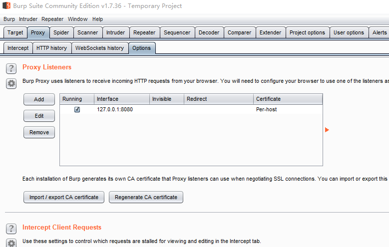
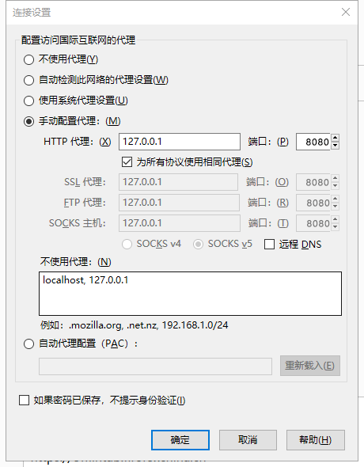
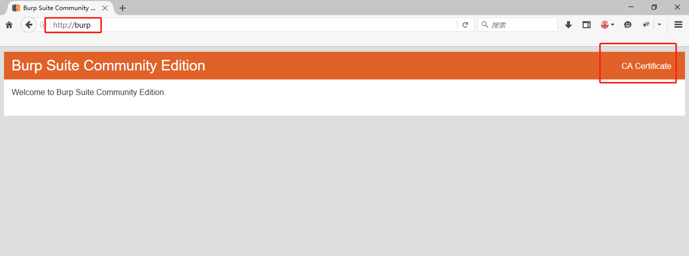
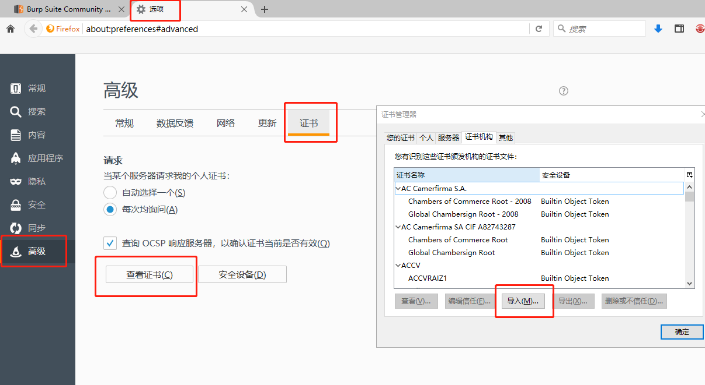
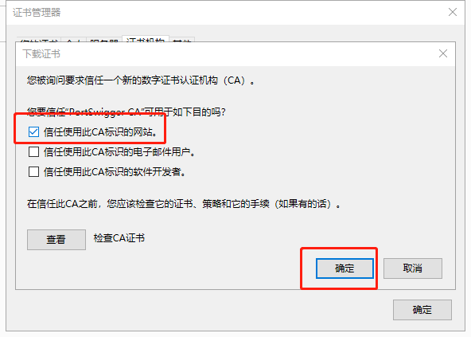
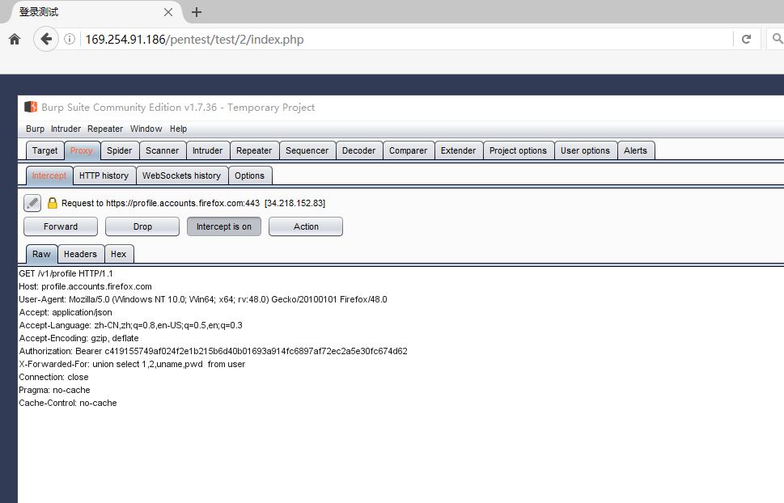
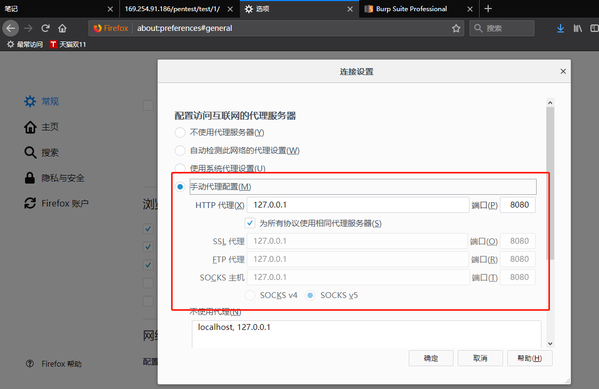
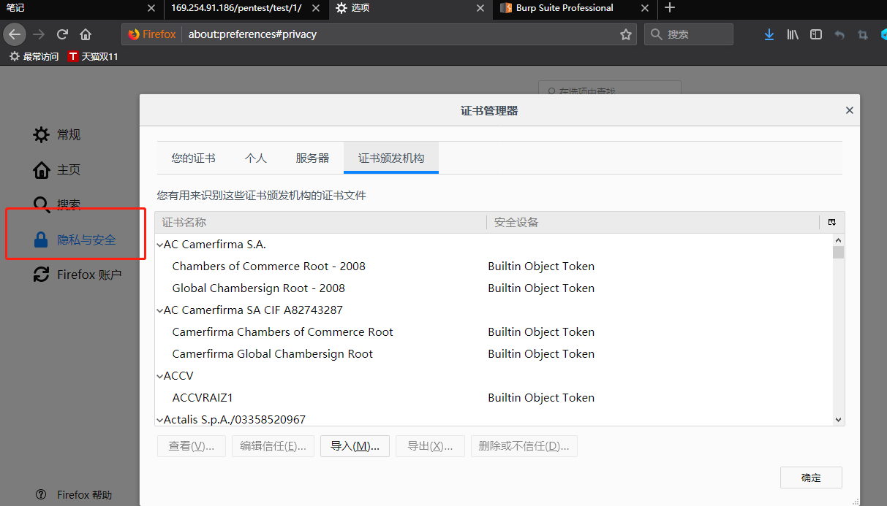

# 配置BurpSuite

## 方法

### 工具:

* 火狐浏览器
* Burp Suite

### 先打开Burp Suite

### 再到火狐中配置代理

### 访问：[http://burp/并下载CA证书](http://burp/并下载CA证书)

### 导入证书

### 勾选第一个

### 可以开始抓包了

## 新版火狐浏览器:

### 新版火狐在选项-常规中配置代理

### 在隐私与安全中配置CA证书

