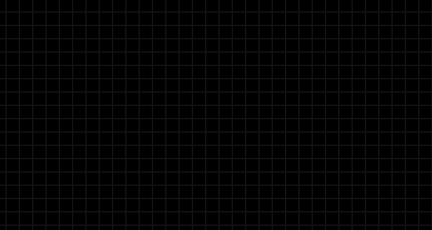
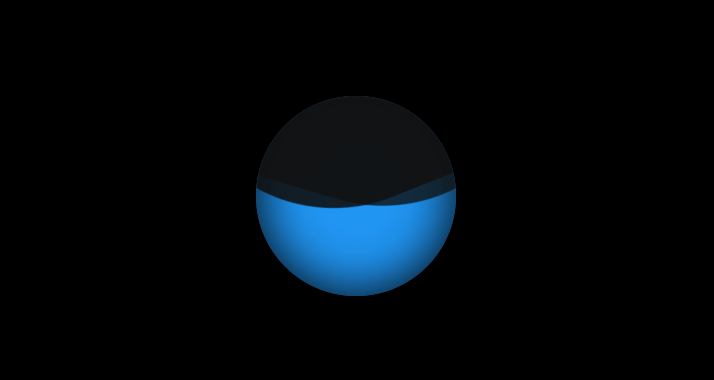
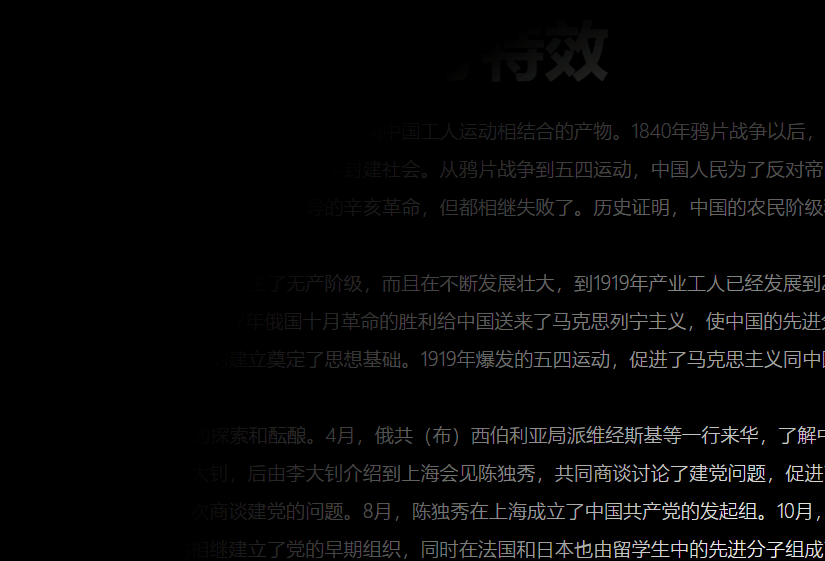
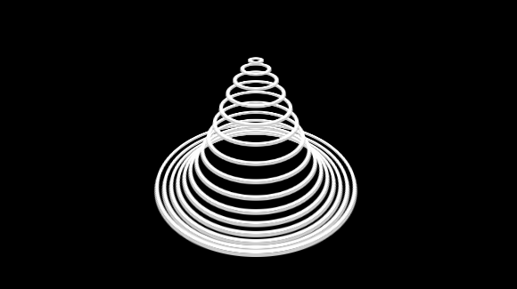
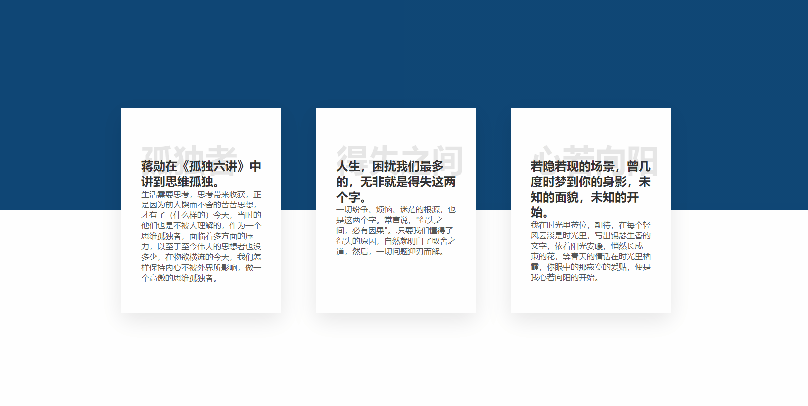

# 前端特效练习

## CSS音频波纹加载

源码：[CSS音频波纹加载](https://codepen.io/ashen114/pen/zYxzEYa)

## CSS 悬停效果

源码：[CSS悬停效果](https://codepen.io/ashen114/pen/BaKGzaO)

效果：

## 纯CSS液体加载特效

源码：[纯CSS液体加载特效](https://codepen.io/ashen114/pen/wvGQygq)

## 滑块百分比的有趣应用

源码：[滑块百分比的有趣应用](https://codepen.io/ashen114/pen/jOqXrOQ)

效果：

## 3D背景动画效果

源码：[滑块百分比的有趣应用](https://codepen.io/ashen114/pen/jOqXRLW)

效果：

## 3D 视频立方体特效

源码：[3D 视频立方体特效](https://codepen.io/ashen114/pen/qbzvbor)

效果：

## 聚光灯特效

源码：[聚光灯效果](https://codepen.io/ashen114/pen/vYGPLov)

效果：

## CSS水波背景动画特效

源码：[CSS水波背景动画特效](https://codepen.io/ashen114/pen/PoNLaPr)

效果：

## CSS加载文本动画特效

源码：[CSS加载文本动画特效](https://codepen.io/ashen114/details/abNxoVG)

效果:

## CSS 3D波浪加载特效

源码：[CSS 3D波浪加载特效](https://codepen%20.io/ashen114/pen/oNLgKWd)

效果：

## 服务条款的一种展示特效

源码：[服务条款的一种展示特效](https://github.com/ashen114/my-blog/tree/a75766a82180e5a9b3746941753d748ee0a92be6/技术总结/code/前端特效练习/服务条款的一种展示特效.html)

效果：

