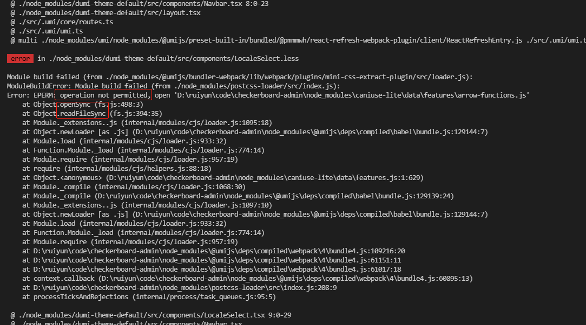
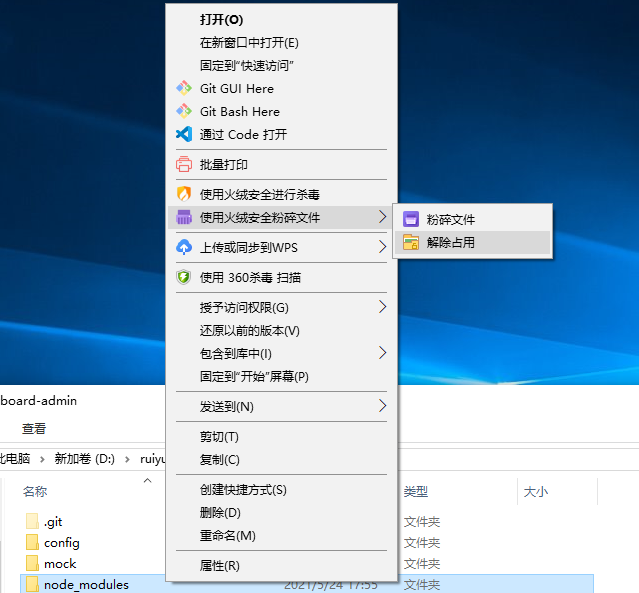
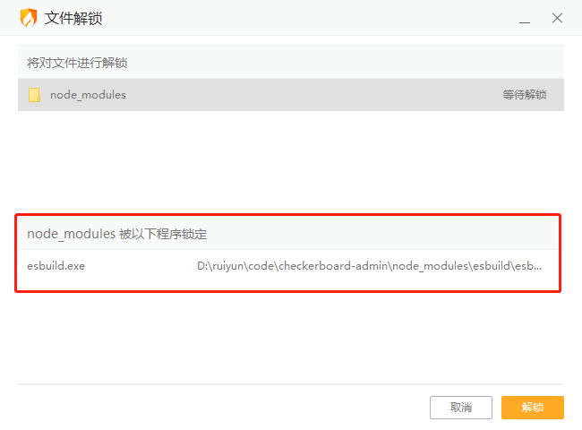
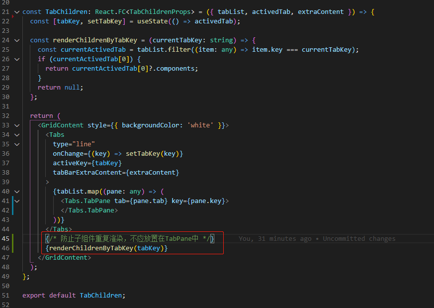

# React开发踩坑记录

问题：yarn start 运行项目提示 operation 权限问题

原因分析：node\_modules文件夹的内容被占用了

解决方案：解除当前文件的占用状态即可，具体如下

1. 重启电脑
2. ~~使用_火绒_解除文件的占用~~（无效）

   需要先安装粉碎工具

   

   

   如图，当前文件夹被其他程序所占用，解锁即可

   

问题：antd的tab子组件重复渲染问题

原因分析：子组件渲染后，不会被销毁，效果如给Tabs.TabPane加上forceRender一样

解决方案：将渲染的组件从子组件中抽离，如图

其他解决方案：[https://blog.csdn.net/GoldenLegs/article/details/89470558](https://blog.csdn.net/GoldenLegs/article/details/89470558)

> 1. 里面只能写纯函数组件, 将每一个子组件中生命周期要执行的方法, 全部放在Tab组件的change回调中, 父传子属性来渲染
> 2. 子组件放Tab组件外部来渲染, 子组件不再被挂载多次, Tab中的动画效果就不作用与子组件了, 可以自己写动画效果

