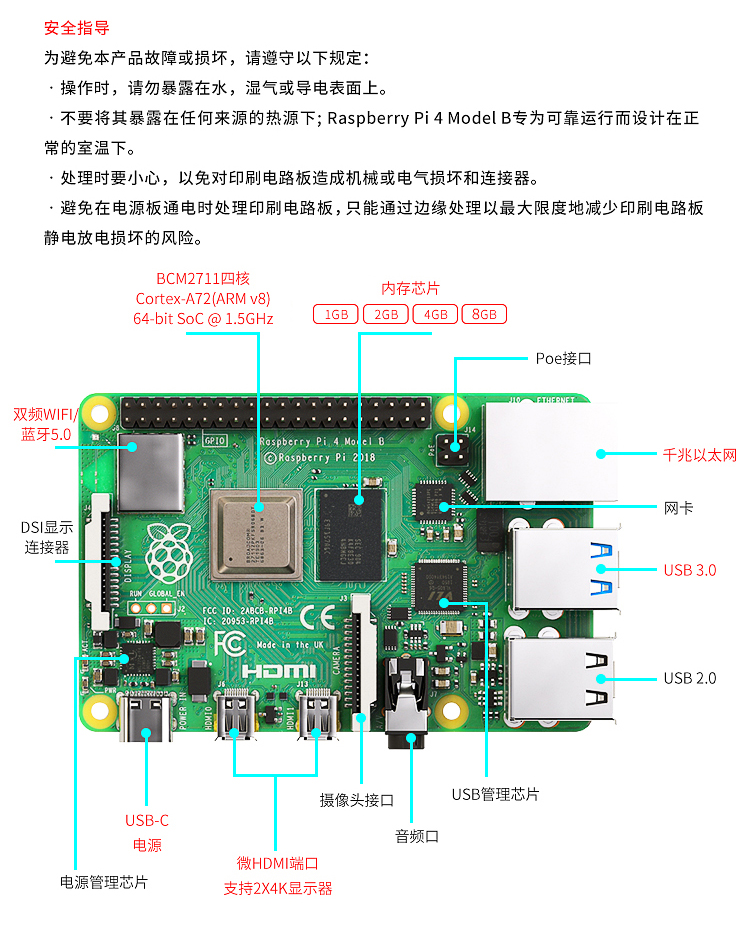
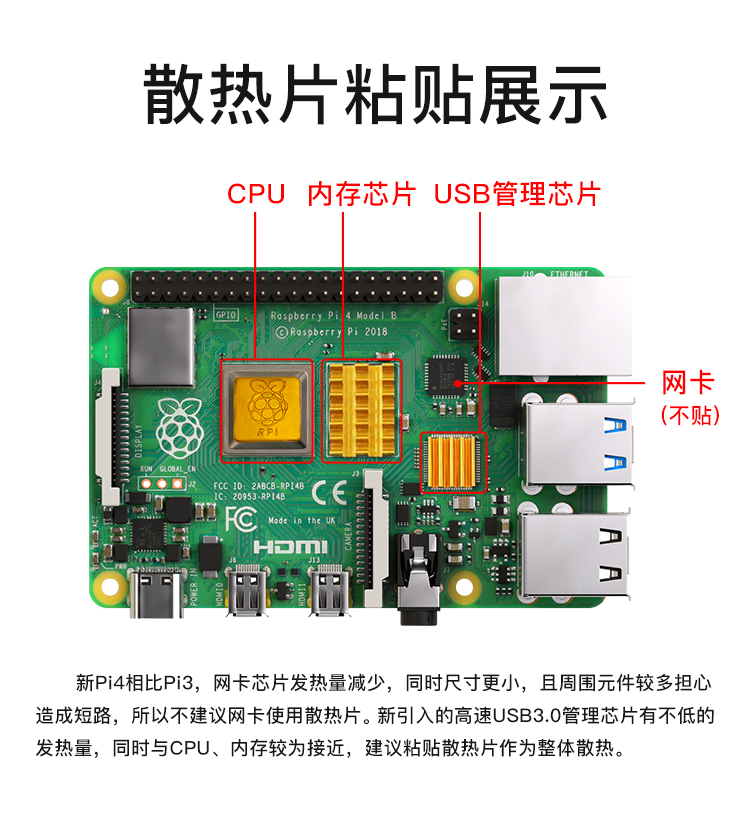
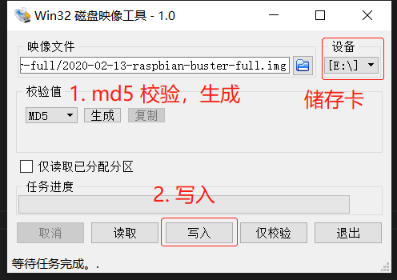
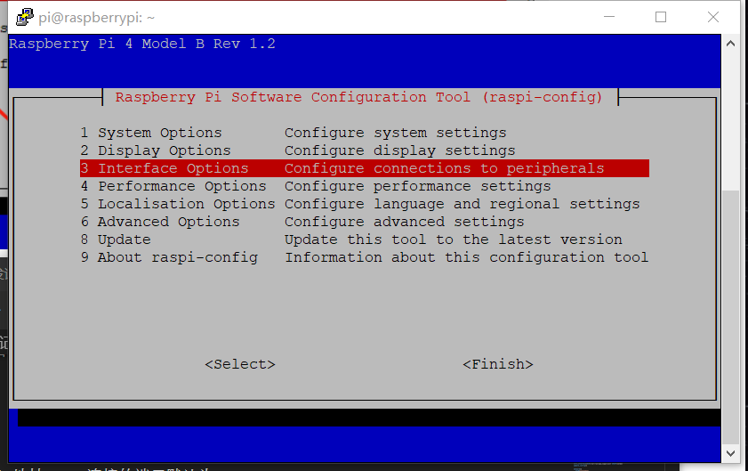
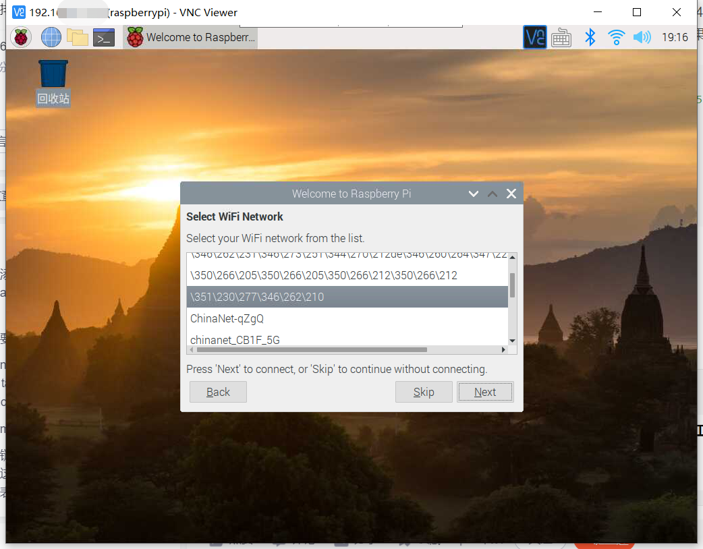

# 树莓派开发记录

## 软硬件准备

### 硬件

* 树莓派4B 4G 开发板
* 官方电源
* 读卡器
* 闪迪 32GB 储存卡
* 散热片
* PC
* 手机

### 软件

* PC端
  * [VNC Viewer](https://www.realvnc.com/en/connect/download/viewer/)：远程控制程序，可使用图形化界面操作树莓派
  * [Win32DiskImager](https://win32diskimager.download/download-win32-disk-imager/)：系统安装工具
  * [2020-02-13-raspbian-buster-full.img](https://mirrors.tuna.tsinghua.edu.cn/raspberry-pi-os-images/raspbian_full/images/raspbian_full-2020-02-14/2020-02-13-raspbian-buster-full.zip)：系统资源可以从国内各大镜像网站下载，例如：清华大学开源软件镜像站
  * [putty](https://www.chiark.greenend.org.uk/~sgtatham/putty/latest.html)：可使用SSH等连接的工具，以操作树莓派
* 移动端（安卓）
  * JuiceSSH：可使用SSH等连接的工具，以操作树莓派
  * VNC Viewer：远程控制程序，可使用图形化界面操作树莓派

## 树莓派4B结构



## 散热片安装



## 安装 raspbian 系统

这步主要是在PC上对储存卡进行 `raspbian` 系统 写入，具体步骤如下

1. 插入读卡器+储存卡到PC上
2. 使用 Win32DiskImager 将 2020-02-13-raspbian-buster-full.img 安装到储存卡上

   

   注：写入系统前，可先将储存卡进行 `FAT` 格式；若写入系统失败可再次进行 `FAT` 格式化，若已分出了系统盘，`win10` 可在 _计算机管理_ - _存储_ - _磁盘管理_ 处，对储存卡进行重新分区

3. 写入成功后，则可继续下一步

## 设置并连接 wifi

这步主要是为树莓派系统设置`wifi`连接，以方便以后进行`SSH`，远程控制等，具体步骤如下

1. 安装 `raspbian` 系统成功后，可进入树莓派的系统盘`boot`目录下，新建文件：`wpa_supplicant.conf`，推荐使用非中文的wifi名称，防止后期会被转码等

ssid: wifi名称 psk：wifi密码 key\_mgmt：加密方式，可选：WPA-PSK、NONE等 priority：优先级，值越大越优先

```text
country=CN
ctrl_interface=DIR=/var/run/wpa_supplicant GROUP=netdev
update_config=1

network={
  ssid="wifi1名称"
  psk="wifi1密码"
  key_mgmt=WPA-PSK
  priority=2
}

network={
  ssid="wifi2名称"
  psk="wifi2名称"
  key_mgmt=WPA-PSK
  priority=1
}
```

1. 同时，新建一个名为`ssh`的空文档
2. 完成上述步骤后，将存储卡插到树莓派上（插槽在开发板的背面）
3. 连接电源，树莓派会自动根据上述的wifi配置进行连接
4. 在wifi源查找树莓派的地址，例如：若是手机开启的热点，则可在已连接设置处查看其ip地址

> 此时，再次打开boot目录，会发现上述的wpa\_supplicant.conf与ssh文件不存在于当前根目录，正常现象

## SSH连接

PC端：

1. 在PC上打开 putty 输入 上述得到的ip地址，SSH连接的端口默认为22

   注意：默认的树莓派账号为 **pi** ，密码为 **raspberry**

2. 登录成功后，可进行VNC配置，以便使用图形化形式操作树莓派，输入 `sudo raspi-config`
3. 选择 `Interface Options`

   

4. 然后选择 `SSH`，使其 `enabled`，然后再次选择 `Interface Options`，选择 `VNC`，使其 `enabled`
5. 最后，设置一下分辨率，选择 `Advanced Options` - `Resolution`，然后选择合适的分辨率即可，例如：1920\*1080
6. 完成上述配置后，选择 `Finish`，重启树莓派
7. 打开 VNC Viewer ，输入 树莓派的ip地址 及账号密码等，进行连接即可

   

   注意：上图的中文名的wifi名称被转换了

移动端：和PC端类似，SSH连接工具可以使用 JuiceSSH，图形化操作工具可以使用 VNC Viewer

