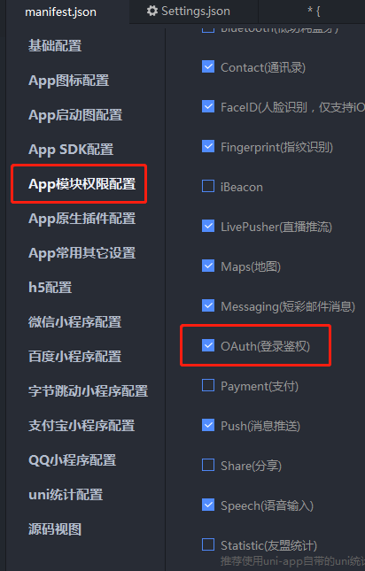
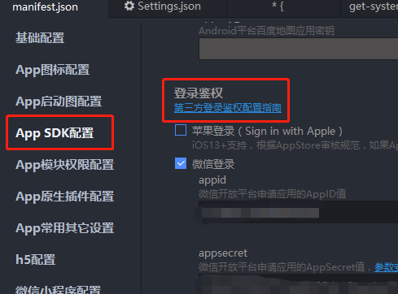
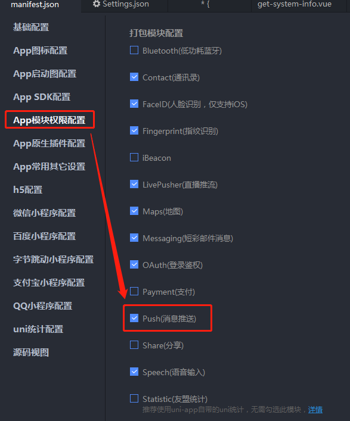
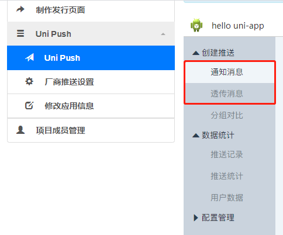
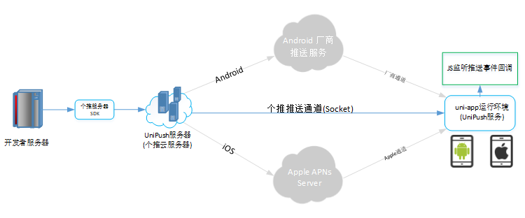
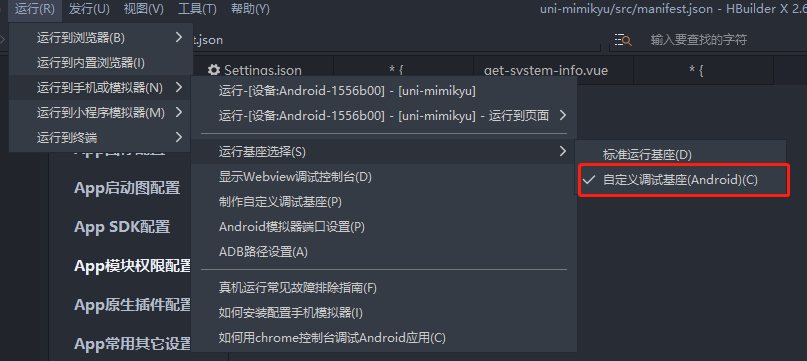
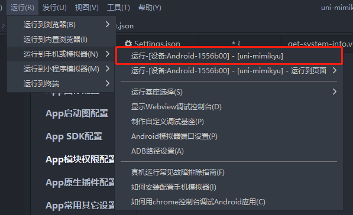
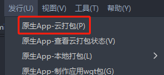
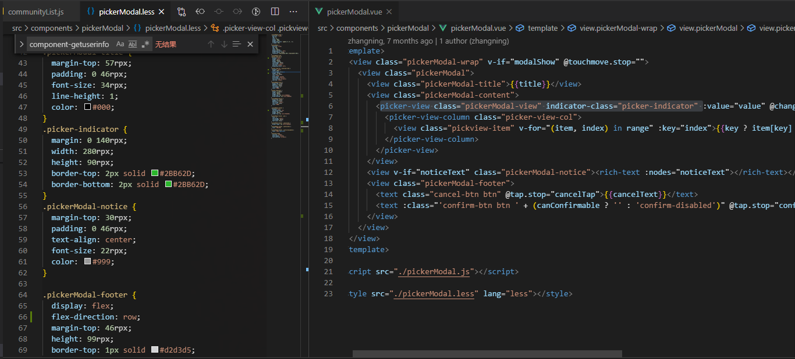

# uni-app 踩坑记录

## 安装&配置

> 安装uni-app模板时，node版本需要大于10.14，推荐使用nvm安装node，便于切换node版本

`npm install -g @vue/cli`

`vue create -p dcloudio/uni-preset-vue my-project`

~~`npm i @dcloudio/uni-helper-json` uni-组件语法提示~~

~~`npm i @types/uni-app @types/html5plus -D` uni语法提示~~

`uni`项目下的`json`文件，因为带有注释，推荐使用`jsonc`语言模式，以便消除报错提示

让vscode支持nve格式的文件，先安装`vetur`插件，然后：在`文件`-`首选项`-`设置`中输入`associations`，找到`Files:Associations`选择其下方的`进入setting.json中设置`，加入`"*.nvue": "html"`，然后重新加载窗口\(可以通过`F1`，然后输入`重新加载窗口`进行重载窗口\)，完整版如下：

```javascript
"files.associations": {
    "*.nvue": "html"
},
```

使用yarn安装依赖时，若出现问题，把yarn.lock和node\_modules删除再试

## 开发

### 功能模块

#### 第三方登录

在`src\manifest.json`中配置相关的模块，若是HBuilderX，则如下：



然后在下图所示中进行对应的配置：



### 插件

#### 消息推送

> 使用uni提供的Uni Push

1. 在项目中配置push模块

   在`src\manifest.json`中配置相关的模块，若是HBuilderX，则如下：

   

2. 在项目中使用`plus.push.getClientInfo`获取客户端CID，方便后期针对性调试，例如：

   ```javascript
    getCInfo(){
        document.addEventListener('plusready', function(){  
            // 页面加载时触发  
            let pinf = plus.push.getClientInfo();  
            let cid = pinf.clientid;//客户端标识  
        }, false );
    }
   ```

3. 运行项目，具体可参考步骤["运行&测试"](uniapp-cai-keng-ji-lu.md#运测)
4. 后台推送

   主要有两种方法，一是使用DCloud管理后台，二是自己搭建服务端：

   1. 在DCloud管理后台使用`Uni Push`进行推送

      进入DCloud后台:[https://dev.dcloud.net.cn/uni/push?appid=**UNI**596F7C0&type=0](https://dev.dcloud.net.cn/uni/push?appid=__UNI__596F7C0&type=0)，在Uni Push中分为两种事件，如下：

      

      可在应用入口对该通知消息及透传消息进行监听，具体可参考：[https://ask.dcloud.net.cn/article/34](https://ask.dcloud.net.cn/article/34)

      > _通知消息_可将通知展示到app的通知栏上，但是只能监听点击事件；_透传消息_只能通过无形的方式传递到app中，但是可以通过对`receive`进行监听以获取传递过来的信息。

      在调试消息功能模块时，在`预览消息`的时候，可以使用上述步骤2中获取到的`clientid`进行特定预览。

   2. 使用Node搭建消息推送服务

      原理文档：[https://ask.dcloud.net.cn/article/35622](https://ask.dcloud.net.cn/article/35622)

      

      参考文档：[http://docs.getui.com/getui/server/nodejs/start/](http://docs.getui.com/getui/server/nodejs/start/)

      ```javascript
        // 消息模版：
        // 1.TransmissionTemplate:透传功能模板
        // 2.LinkTemplate:通知打开链接功能模板
        // 3.NotificationTemplate：通知透传功能模板
        // 4.NotyPopLoadTemplate：通知弹框下载功能模板
      ```

#### 语音播报

> 使用 `百度语音合成接口` 插件

插件链接：[https://ext.dcloud.net.cn/plugin?id=182](https://ext.dcloud.net.cn/plugin?id=182)

可以通过监听_透传消息_进行_语音播报_提示

#### 拖拽排序组件

插件链接：[https://ext.dcloud.net.cn/plugin?id=582](https://ext.dcloud.net.cn/plugin?id=582)

若需要自定义删除标签的事件，可通过在组件中的close事件中发送$emit，其中由于存在对传入的list进行深度监听，可利用该功能，在父组件中合理改变list以触发事件。

## 运行&测试

### 虚拟机调试

* 安装“360助手”
* 安装安卓模拟器（这里使用的是MuMu模拟器）

配置模拟器端口


> 更多模拟器端口参考：[https://www.cnblogs.com/HakunaMatata-/p/10609307.html](https://www.cnblogs.com/HakunaMatata-/p/10609307.html)

打开360助手，直接挂后台即可，不需要额外处理，仅作为连接HBuilderX及模拟器的工具

打开MuMu模拟器，作为调试模拟器

有两种基座种类的选择进行调试，如图所示，若使用自定义基座，请先进行“制作自定义基座”


### 真机调试

若是使用真机调试，可使用



此时，真机端需要通过USB连接电脑，且开启USB调试，然后



即可，每次更改代码会进行热更新

## 打包

### 安卓

#### 开发工具选择

1. HBuilderX 使用`HBuilderX`打包，在`src/manifest.json`中进行相关配置
2. Android Studio

```text
硬盘空间不足，取消android studio的打包方式#

jre配置，用于安卓设备的证书生成：

参考链接：https://ask.dcloud.net.cn/article/35777

下载来源：https://www.oracle.com/java/technologies/javase-jre8-downloads.html

window下载：https://download.oracle.com/otn/java/jdk/8u251-b08/3d5a2bb8f8d4428bbe94aed7ec7ae784/jre-8u251-windows-x64.exe
```

#### 打包配置

若使用HBuilder，则可以如下图所示，若还没appid等，按步骤进行即可



## 附加

### 样式问题

nvue相对来说，对css的兼容性不佳，不推荐在nvue中使用丰富的样式，尤其是flex布局等

### 文件名过长删除问题

删除文件名过长的文件，可以在其父级文件夹（例如:a）的同级目录下新建空文件夹，例如:b

`robocopy b a /purge` a文件夹为需要删除的文件夹

执行命令后再手动删除a，b文件夹即可，此时可正常删除文件夹

### Vue模板输入框输入问题

> 下列方法问题：用户清除输入框时，输入框的内容会为空且不是期望的0

```markup
<input type="number" v-model="writeOffNum" @blur="bindInputWriteOffNum"></input>
```

```javascript
/**
 * 可核销数量规则
 * @param {number} value
 * @param {string} changeType 可选 操作类型 'sub || 'add'
 */
calWriteOffNumRule:function(value,changeType){
    let maxNum = this.canVerifyNums; // 最大可核销数
    if(changeType){
    // 若为点击事件
    switch(changeType){
        case 'sub': 
        if(value > 0){
            value -= 1;
        }else{
            value = 0;
        }
        break;
        case 'add':
        if(value < maxNum){
            value += 1;
        }else{
            value = maxNum
        }
        break;
    }
    }else{
    // 若为输入
    if(!value || isNaN(value) || value < 0){
        value = 0;
    }else if(value > maxNum){
        value = maxNum;
    }
    }
    return value;
},
/**
 * 改变核销数量（输入）
 * @param event
 */
bindInputWriteOffNum:function(event){
    let value = event.detail.value || 0;
    this.setData({
    writeOffNum: this.calWriteOffNumRule(+value)
    })
}
```

### 取事件event的不同

```text
小程序：event.currentTarget.dataset
```

### 控制台错误汇总

* Browserslist: caniuse-lite is outdated. Please run next command `npm update`

  ``npm i caniuse-lite` / `npm update caniuse-lite` / `npm i -g caniuse-lite``

* getApp\(\) 操作失败，v3模式加速了首页 nvue 的启动速度，当在首页 nvue 中使用 getApp\(\) 不一定可以获取真正的 App 对象。

  v3模式加速了首页 nvue 的启动速度，当在首页 nvue 中访问 getApp 不一定可以获取真正的 App 对象。对此v3版本提供了const app = getApp\({allowDefault: true}\)用来获取原始的app对象，可以用来在首页对globalData等初始化

* You should write display: flex by final spec instead of display: box

  将 display:box 改为 display:flex

* Module parse failed: The keyword 'package' is reserved

  目前（2020/07/20）HBuilderX的云打包使用了V3模式（严格模式），避免代码中出现“关键词”，尤其注意Vue模板。

* xx undefined

  严格判断Vue模板和js文件中是否存在文件未定义情况，对未初始化的变量进行undefined判断，例如：person && person.info

* Property or method "toJSON" is not defined on the instance but referenced during render. Make sure that this property is reactive, either in the data option, or for class-based components, by initializing the property

  严格模式下，不允许变量随意更改类型。

* Avoid adding reactive properties to a Vue instance or its root $data at runtime - declare it upfront in the data option.

  ```javascript
        let pages = getCurrentPages(),
        prePage = pages[pages.length - 2];
    if(prePage.$vm.hasOwnProperty('isTurnBack')){ // 加上判断
        prePage.$vm.setData({
        isTurnBack: true
        });
    }
  ```

* Unbalanced delimiter found in string

  `// #ifdef` 没有闭合，加上 `// #endif`

* 无法将“keytool”项识别为 cmdlet、函数、脚本文...

  进入D:\Program Files\Java\jdk1.8.0\_251\jre\bin，shift+右键启用cmd，输入：keytool -importkeystore -srckeystore zhichi.keystore -destkeystore zhichi.keystore -deststoretype pkcs12

### 组件的引入方式-讨论

在`src\components`下组件中引用App.vue的方法时，可以使用宏任务setTimeout先行执行引入

```javascript
let app = {}

setTimeout(()=>{
  app = getApp({allowDefault: true}).globalData;
},100)
```

[https://ask.dcloud.net.cn/question/66748](https://ask.dcloud.net.cn/question/66748)

### 使用 this.setData 无效

```javascript
// src\main.js
Vue.prototype.setData = function (obj) {
    let that = this;
    let keys = [];
    let val, data;
    Object.keys(obj).forEach(function (key) {
      keys = key.replace(/\]/g, '').split(/\.|\[/);
      val = obj[key];
      data = that.$data;
      keys.forEach(function (key2, index) {
        if (index + 1 == keys.length) {
          that.$set(data, key2, val);
        } else {
          if (!data[key2]) {
            that.$set(data, key2, {});
          }
        }

        data = data[key2];
      });
    });
}
```

在`this.setData()`前使用`this.$forceUpdate()`进行强制刷新数据（或者手动更新数据，先赋空，再赋值原数据）

### 上个页面进行刷新

在当前页面定义一个变量作为是否需要刷新的标记，在onShow检测改变量，在页面跳转前将该标记设置为true即可

### 安卓app的picker-view标签不兼容indicator-class="picker-indicator"




解决方案：不兼容，暂无

### chooseImage和chooseVideo，在小程序上和app上的“取消选择”fail差异

解决：

```javascript
// #ifdef MP-WEIXIN
if (err.errMsg != 'chooseVideo:fail cancel') {
    app.showModal({
    content: '上传出错，请重新选择上传'
    });
}
// #endif

// #ifdef APP-PLUS
if (err.errMsg != 'chooseVideo:fail') {
    app.showModal({
    content: '上传出错，请重新选择上传'
    });
}
// #endif
```

### app对cover-view标签貌似不太友好

解决：临时解决方案为改为view

### 使用prePage的地方，需要使用$vm替换data，例如：

解决：

```javascript
let pages = getCurrentPages();
let prePage = pages[pages.length - 2];
let innerText = '';
if (that.type == 'text') {
    innerText = prePage.$vm.topicParam.text;
} else if (that.type == 'hidden_content') {
    innerText = prePage.$vm.topicParam.hidden_content;
}
```

原本使用prePage.data传值，现改为prePage.$vm，但是$vm为VueComponent类型，故采用以下办法筛选出data的值

```javascript
  let prePageData = {}
  for(let item in prePage.$vm){
    if(typeof prePage.$vm[item] != 'function' && /^[a-zA-Z]+$/.test(item)){
      Object.assign(prePageData,{ [item]:prePage.$vm[item]})
    }
  }
  this.setData({
    couponInfo: prePageData,
    appName: app.gbData.appName
  })
```

### 更新switch的checked

参考\([https://ask.dcloud.net.cn/question/75669\)方法，更新switch的checked](https://ask.dcloud.net.cn/question/75669%29方法，更新switch的checked)

```javascript
// 先更新checked
that.$set(that.storeConfig.cart_config, 'is_merge_shoppingcart', value ? 1 : 0)
if(value){
app.showModal({
    content: '合并购物车之后，微信支付将不能进行分账。若想继续使用分账功能，请关闭合并购物车!',
    showCancel: true,
    confirm: function(){
    that.setData({
        'storeConfig.cart_config.is_merge_shoppingcart': 1
    })
    },
    cancel: function(){
    that.setData({
        'storeConfig.cart_config.is_merge_shoppingcart': 0
    })
    }
})
}else{
that.setData({
    'storeConfig.cart_config.is_merge_shoppingcart': 0
})
}
```

### 对象传URL不兼容非V8引擎

在打包app后，由于app失去了V8引擎（调试的时候有V8），此时下方方法出现了不兼容的情况：会出现`a=1,2`的情况，期望能出现`a[0]=1,a[2]=2`

```javascript
  // 不兼容非V8引擎
  function modifyPostParam(obj) {
      let query = '',
              name, value, fullSubName, subName, subValue, innerObj, i;

      for(name in obj) {
          value = obj[name];
          if(value instanceof Array) {
              for(i=0; i < value.length; ++i) {
                  subValue = value[i];
                  fullSubName = name + '[' + i + ']';
                  innerObj = {};
                  innerObj[fullSubName] = subValue;
                  query += modifyPostParam(innerObj) + '&';
              }
          }
          else if(value instanceof Object) {
              for(subName in value) {
                  subValue = value[subName];
                  fullSubName = name + '[' + subName + ']';
                  innerObj = {};
                  innerObj[fullSubName] = subValue;
                  query += modifyPostParam(innerObj) + '&';
              }
          }
          else if(value !== undefined && value !== null)
              query += encodeURIComponent(name) + '=' + encodeURIComponent(value) + '&';
      }

      return query.length ? query.substr(0, query.length - 1) : query;
  }
  console.log(modifyPostParam({
      "pick_up_type": ["1", "2"]
  }));
```

```javascript
  // 兼容非V8引擎
  function modifyPostParam (param, key, encode) {
    if (param == null) return '';
    var paramStr = '';
    var t = typeof(param);
    if (t == 'string' || t == 'number' || t == 'boolean') {
      paramStr += '&' + key + '=' + ((encode == null || encode) ? encodeURIComponent(param) : param);
    } else {
      for (var i in param) {
        var k = key == null ? i : key + '[' + i + ']';
        paramStr += this.modifyPostParam(param[i], k, encode);
      }
    }
    return paramStr;
  },

  console.log(modifyPostParam({
    "pick_up_type": ["1", "2"]
  })).substr(1) // 注意去掉开头的&
```

### 参考链接汇总

Push推送开发指南：[https://ask.dcloud.net.cn/article/34](https://ask.dcloud.net.cn/article/34)

UniPush使用指南：[https://ask.dcloud.net.cn/article/35622](https://ask.dcloud.net.cn/article/35622)

百度语音合成接口：[https://ext.dcloud.net.cn/plugin?id=182](https://ext.dcloud.net.cn/plugin?id=182)

什么是自定义调试基座及使用说明：[https://ask.dcloud.net.cn/article/35115](https://ask.dcloud.net.cn/article/35115)

~~监听通知栏消息：~~[~~https://ext.dcloud.net.cn/plugin?id=835~~](https://ext.dcloud.net.cn/plugin?id=835)

~~自定义推送铃声（iOS）：~~[~~https://ext.dcloud.net.cn/plugin?id=690~~](https://ext.dcloud.net.cn/plugin?id=690)

授权登录插件配置：[https://ask.dcloud.net.cn/article/192](https://ask.dcloud.net.cn/article/192)

个推文档 &gt; 服务端 &gt; PHP &gt; 概述：[http://docs.getui.com/getui/server/php/summary/](http://docs.getui.com/getui/server/php/summary/)

个推文档 &gt; 服务端 &gt; NodeJs &gt; 快速入门：[http://docs.getui.com/getui/server/nodejs/start/](http://docs.getui.com/getui/server/nodejs/start/)

app调试-模拟器配置：[https://ask.dcloud.net.cn/article/1024](https://ask.dcloud.net.cn/article/1024)

