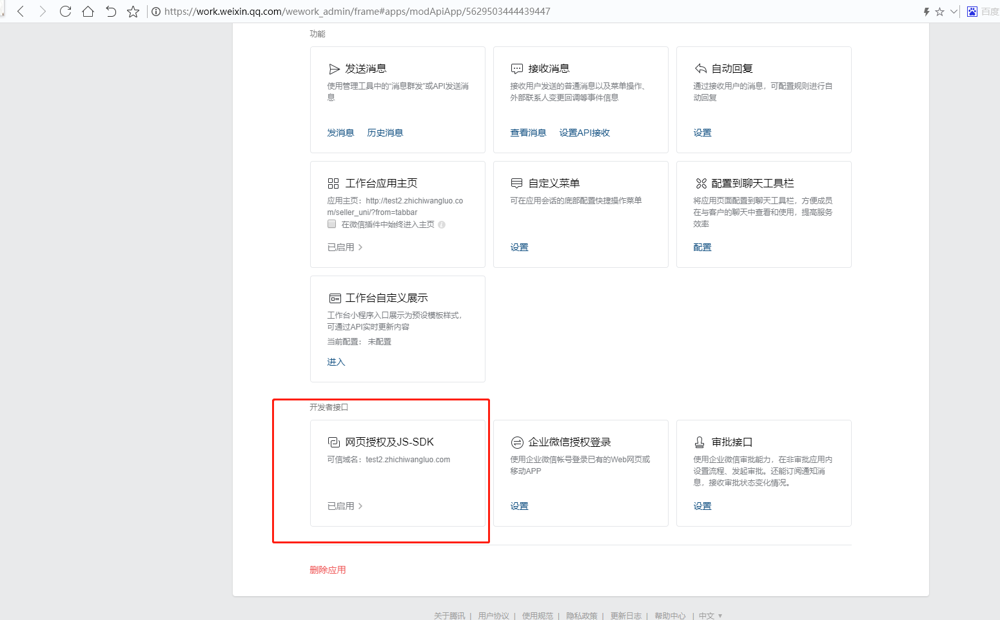

# 微信开发相关踩坑记录

## 微信小程序

### 安卓与ios的异常

> 同一份代码在安卓和ios上的异常记录

#### chooseLocation未授权的报错

```javascript
chooseLocation: function (options) {
    let that = this;
    wx.chooseLocation({
    success: function (res) {
        typeof options.success === 'function' && options.success(res);
    },
    cancel: options.cancel,
    fail: function(res){
        /**
        * chooseLocation在安卓和ios上的差异
        * 未授权：
        * 安卓：errMsg:"getLocation:fail auth deny"
        * 苹果：errMsg:"getLocation:fail authorize no response"
        */
        if (res.errMsg.includes('chooseLocation:fail')){
        that.showModal({
            content: '您之前拒绝授权我们使用您的定位，致使我们无法定位，是否重新授权定位？',
            showCancel: true,
            cancelText: "否",
            confirmText: "是",
            confirm: function () {
            wx.openSetting({
                success: function (res) {
                if (res.authSetting['scope.userLocation'] === true) {
                    that.chooseLocation(options);
                }
                }
            })
            },
            cancel: function () {
            typeof options.fail === 'function' && options.fail();
            }
        })
        } else {
        typeof options.fail === 'function' && options.fail();
        }
    }
    });
},
```

### 真机异常

> 在模拟器正常，在真机异常记录

#### canvas不断点击绘制会不断放大

```javascript
data: {
    isCanvasMax: false, // 第二次绘制不需要缩放坐标
},
...
initCanvas(res) {
const {width, height, node} = res[0]
const ctx = node.getContext('2d')
const dpr = wx.getSystemInfoSync().pixelRatio
node.width = width * dpr
node.height = height * dpr
// 第二次绘制不需要缩放坐标
if(!this.data.isCanvasMax){
    ctx.scale(dpr, dpr)
    this.setData({
    isCanvasMax: true
    })
}
this.setData({ "canvas": node })
this.drawShareImg()
},
```

## 企业微信

### 安卓与ios的异常

#### 全局变量wx和jWeixin的不同

在安卓上为jWeixin，在ios上为wx；可以分平台来赋予新的变量，例如在`uni-app`的`App.vue`中设置

```javascript
// #ifdef H5
if(that.globalData.gbData.userAgentInfo == 'wxwork'){
    if(that.globalData.gbData.currentDevice == 'ios'){
        that.globalData.gbData.wxWorkAPI = wx;
    }else{
        that.globalData.gbData.wxWorkAPI = jWeixin;
    }
}
that.gbData.wxWorkAPI.config({
    beta: true, // 必须这么写，否则wx.invoke调用形式的jsapi会有问题
    debug: false, // 开启调试模式
    appId: info.crop_id, // 必填，企业微信的corpID（服务商）
    timestamp: info.timestamp, // 必填，生成签名的时间戳
    nonceStr: info.noncestr, // 必填，生成签名的随机串
    signature: info.sign, // 必填，签名，见 附录-JS-SDK使用权限签名算法
    jsApiList: jsApiList // 必填，需要使用的JS接口列表，凡是要调用的接口都需要传进来
});
...
// #endif
```

#### 权限问题

**使用jWeixin..invoke\('getContext', {...}\)**

> 应用场景：客户画像...

如果是自建应用需要配置到客户联系调用应用里面，如果是第三方应用需要有开启企业客户权限。

**https://open.work.weixin.qq.com/devtool/query?e=80001**

在开发者接口在配置**网页授权及JS-SDK**中配置相关的可信域名



