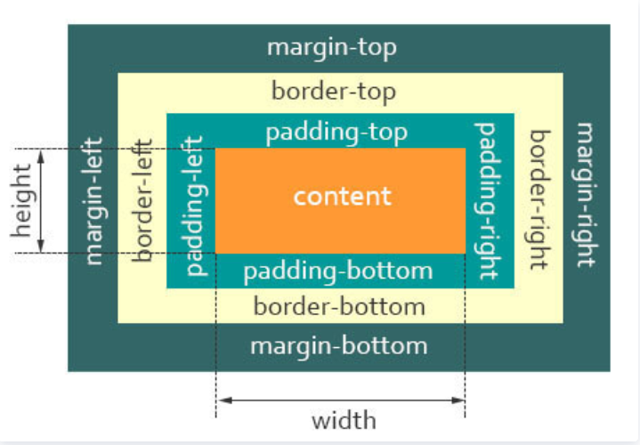
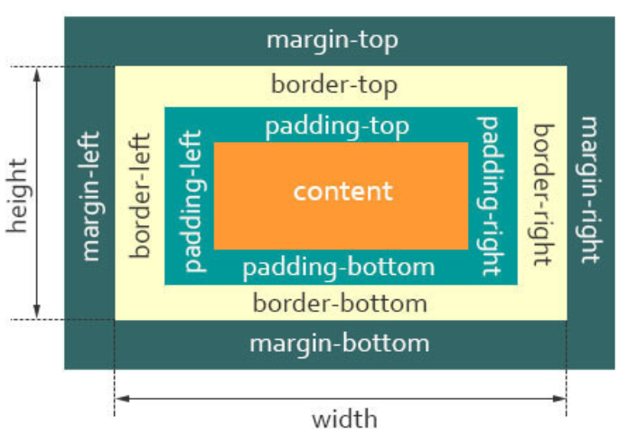
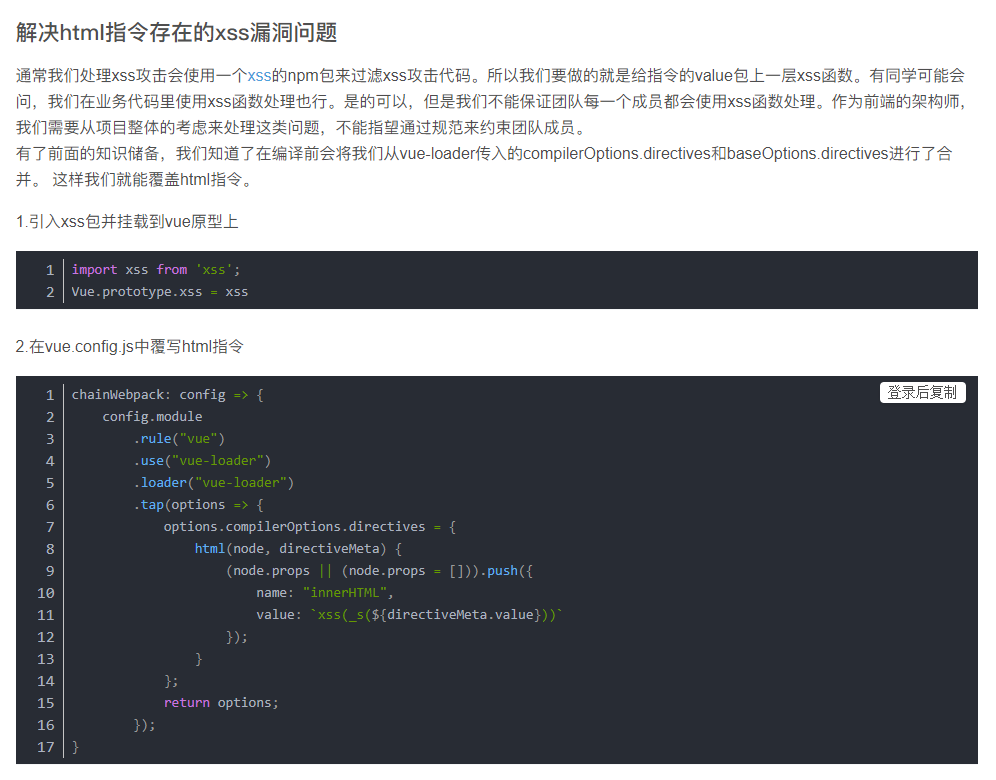
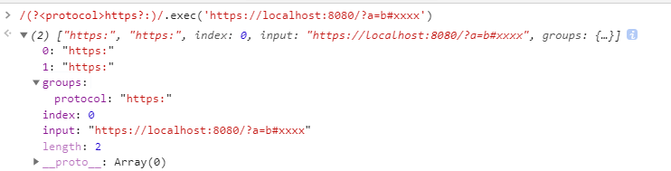
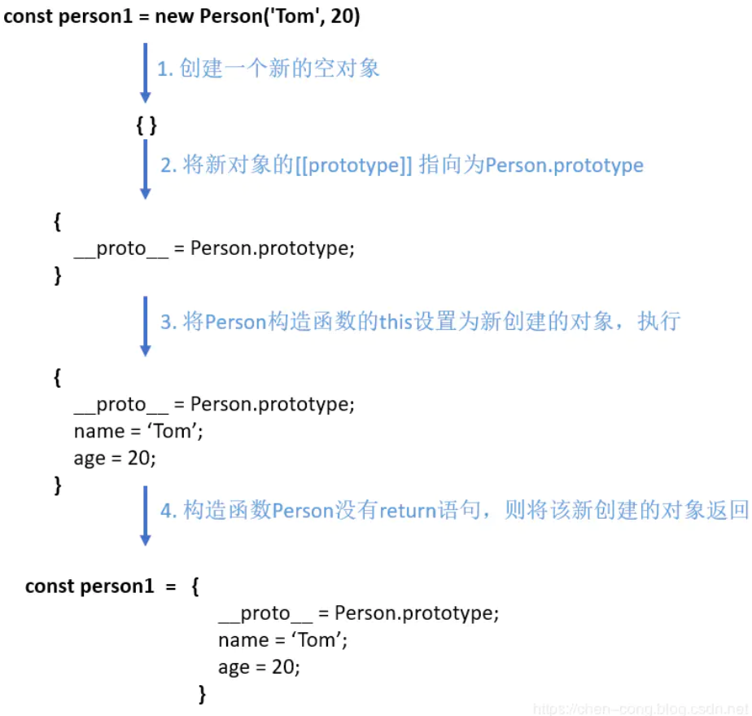
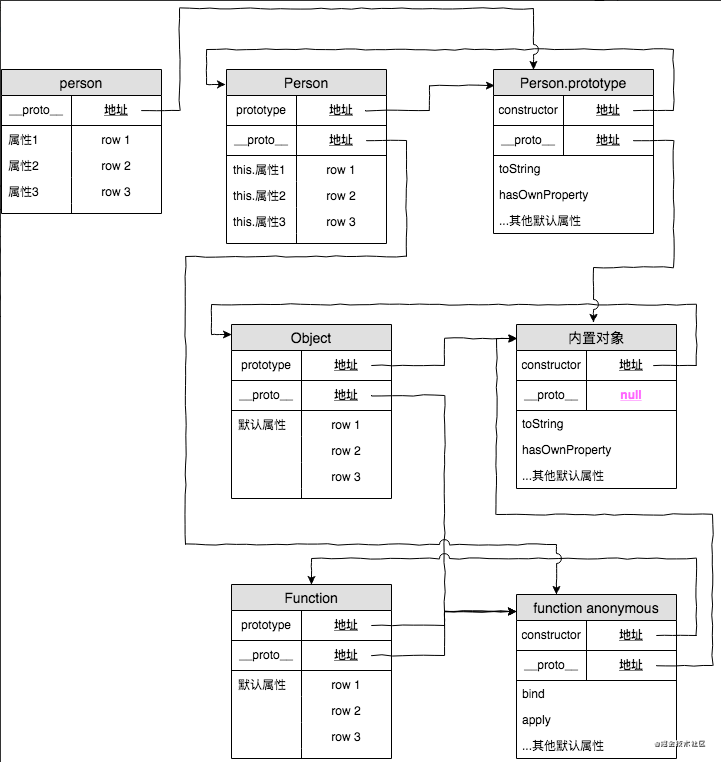

# CSS

## CSS选择器

[CSS选择器](https://mp.weixin.qq.com/s/hCaRwKswMVdK8ZrYfqcTcA)

内联 > ID选择器 > 类选择器 > 标签选择器

代码片段：https://codepen.io/ashen114/pen/qBRMVJZ

```html
<ul id="nav" class="list">
  <li>123</li>
</ul>
```

```css
#nav {
  background: red;
}
.list {
  background: yellow;
}
ul {
  background: green;
}
```

## 盒模型

[盒模型](https://mp.weixin.qq.com/s/Kue_0BOBWaBuSjRQe9cnew)

> 涉及：标准盒模型、怪异盒模型

盒子组成部分 = `content` + `padding` + `border` + `margin`



标准盒子模型(`box-sizing: content-box`)

- 宽度：`width` = `content`
- 高度：`height` = `content`



IE怪异盒子模型(box-sizing: border-box)

- 宽度：`width` = `content` + `padding` + `border`
- 高度：`width` = `content` + `padding` + `border`

# JavaScript
## web攻击方式

[web攻击方式](https://mp.weixin.qq.com/s/WWxWJwjnsfINg2QgmPSa_w)

> 设计：web安全，网络安全

### XSS(Cross Site Scripting)：跨站脚本攻击

- 攻击目的：获取 `cookie` 等用于识别客户端身份的信息

- 攻击来源类型：存储型（提交到数据库）、反射型（构造恶意的URL调用接口）、DOM 型（构造恶意URL由浏览器解析并执行）

+ 防范措施：主要从两个方面预防，一是攻击者的提交，二是浏览器的执行

  - 攻击者的提交：在使用 `.innerHTML`、`.outerHTML`、`document.write()` 时要特别小心，不要把不可信的数据作为 HTML 插到页面上，而应尽量使用 `.textContent`、`.setAttribute()` 等，若是Vue技术栈，则需要注意 `v-html` 的使用，可覆写 `v-html` 指令，过滤XSS攻击代码：[https://blog.csdn.net/lingxiaoxi_ling/article/details/105851736](https://blog.csdn.net/lingxiaoxi_ling/article/details/105851736) 
  
  

  - 浏览器的执行：DOM中内联事件监听器，a标签的href，js的`eval()`、`setTimeout()`、`setInterval()`...

### CSRF(Cross-site request forgery)：跨站请求伪造

+ 防止csrf常用方案如下：

  + 阻止不明外域的访问
    - 同源检测
    - Samesite Cookie
  + 提交时要求附加本域才能获取的信息
    - CSRF Token
    - 双重Cookie验证

### SQL注入攻击

[第一关-很简单的一个注入](https://github.com/ashen114/my-blog/blob/main/%E6%8A%80%E6%9C%AF%E6%80%BB%E7%BB%93/WeBug3.0%E7%BB%83%E4%B9%A0%E7%AC%94%E8%AE%B0.md#%E7%AC%AC%E4%B8%80%E5%85%B3-%E5%BE%88%E7%AE%80%E5%8D%95%E7%9A%84%E4%B8%80%E4%B8%AA%E6%B3%A8%E5%85%A5)

## 单点登陆

单点登录（Single Sign On），简称为 SSO

1. 同域名下的单点登录

    利用 Cookie 的 domain 属性设置为父级域名，将Session ID(获取Token) 保存到父域名 

2. 不同域名下的单点登录

  - 在验证中心获取token，提供url携带token至目标系统，验证token合法性，合法则提供，保存cookie；否则回到验证中心登陆
  - 在验证中心获取token，使用iframe + postMessage() 发送token到各个目标系统中，可以写入到localStorage中

    ```js
    /** 验证中心 http://a.com */
    
    // 获取token
    const token = '123'
    
    // 动态创建不可见的iframe，在iframe中设置跨域的HTML
    let iframe = document.createElement('iframe');
    iframe.src = 'http://b.com/main.html';
    document.body.append(iframe);

    // 使用postMessage()将token传递到目标系统
    setTimeout(() => {
      iframe.contentWindow.postMessage(token, 'http://b.com')
    }, 1000);
    // 发送完成后，移除iframe
    setTime(() => {
      iframe.remove();
    }, 2000)
    ```

    ```js
    /** 目标系统之一 http://b.com */

    // 设置监听器，获取并存储token
    window.addEventListener('message', (event) => {
      localStorage.setItem('token', event.data);
    })
    ```

## 断点继传

[断点继传](https://mp.weixin.qq.com/s/5KPCzcX5T0UbR4_P1pd4NQ)

> 涉及：分片切割、Web Work

[Web Workers API](https://developer.mozilla.org/zh-CN/docs/Web/API/Worker)

### Web Workers API Demo

```html
<p>
  计数：
  <output id="result">849</output>
</p>
<p>
  <button onclick="startWorker()">启动 Worker</button>
  <button onclick="stopWorker()">停止 Worker</button>
</p>
```

```js
// 前端代码
var w = null
function startWorker() {
  if (typeof Worker !== 'undefined') {
    if (typeof w == 'undefined') {
      w = new Worker('https://www.w3school.com.cn/example/html5/demo_workers.js')
    }
    w.onmessage = function (event) {
      document.getElementById('result').innerHTML = event.data
    }
  } else {
    document.getElementById('result').innerHTML = 'Sorry, your browser does not support Web Workers...'
  }
}

function stopWorker() {
  w.terminate()
}
```

```js
// demo_workers.js
var i = 0

function timedCount() {
  i = i + 1
  postMessage(i)
  setTimeout('timedCount()', 500)
}

timedCount()
```

----
## 上拉加载下拉刷新

[上拉加载下拉刷新](https://mp.weixin.qq.com/s/BigZ8UbvWCl251VZzPEcOw)

> 涉及：滚动监听、触摸监听、窗口、元素宽高

代码片段：[https://codepen.io/ashen114/pen/dyNygbo](https://codepen.io/ashen114/pen/dyNygbo)

第三方库：开源社区也有很多优秀的解决方案，如 iscroll、better-scroll、pulltorefresh.js 库等等

----

## 判断元素在可视区域内

[元素是否在可视区域](https://mp.weixin.qq.com/s/7lZL6Zkm2AqwfzysXcBz6Q)

> 涉及：元素宽高、结点插入、`IntersectionObserver` 元素可视监听

代码片段：[https://codepen.io/ashen114/pen/wvgwMXP](https://codepen.io/ashen114/pen/wvgwMXP)

```js
/**
 * 教程：http://www.ruanyifeng.com/blog/2016/11/intersectionobserver_api.html
 * IntersectionObserver是浏览器原生提供的构造函数，接受两个参数：callback是可见性变化时的回调函数，option是配置对象（该参数可选）。
 * var io = new IntersectionObserver(callback, option);
 */
var intersectionObserver = new IntersectionObserver(function (entries) {
  // 如果不可见，就返回
  if (entries[0].intersectionRatio <= 0) return
  loadItems(10)
  console.log('Loaded new items')
})

// 开始观察
intersectionObserver.observe(document.querySelector('.scrollerFooter'))
```

----

## 防抖与节流

[防抖与节流](https://mp.weixin.qq.com/s/xGMUjQiZEI7PV8Wlvf_YNA)

> 涉及：闭包、滚动、输入监听、鼠标移动监听

代码片段：[https://codepen.io/ashen114/pen/wvgwMXP](https://codepen.io/ashen114/pen/wvgwMXP)

- 节流： n 秒内只执行一次，n 秒内重复触发只执行一次

  ```js
  // 时间戳写法
  function throttled1(fn, delay = 500) {
    let oldTime = Date.now()
    return function (...args) {
      let newTime = Date.now()
      if (newTime - oldTime >= delay) {
        fn.apply(null, args)
        oldTime = Date.now()
      }
    }
  }

  // 定时器写法
  function throttled2(fn, delay = 500) {
    let timer = null
    return function (...args) {
      if (!timer) {
        timer = setTimeout(() => {
          fn.apply(this, args)
          timer = null
        }, delay)
      }
    }
  }

  // 时间戳+定时器的写法（更精确的节流）
  function throttled(fn, delay = 500) {
    let timer = null
    let startTime = null
    return function () {
      let curTime = Date.now() // 当前时间
      let remaining = delay - (curTime - startTime) // 从上一次执行到现在，剩余的时间
      let context = this
      let args = arguments
      timer && clearTimeout(timer) // 每次执行，先清除现有的定时器
      if (remaining <= 0) {
        fn.apply(context, args)
        startTime = Date.now()
      } else {
        timer = setTimeout(fn, remaining)
      }
    }
  }
  ```

- 防抖：n 秒后执行一次，n 秒内重复触发，则重新计时，n 秒后执行一次

  ```js
  // 简单版：n 秒后执行一次
  function debounce1(fn, delay) {
    let timer = null
    return function () {
      let context = this
      let args = arguments

      clearTimeout(timer)
      timer = setTimeout(() => {
        fn.apply(context, args)
      }, delay)
    }
  }

  // 立即执行版
  function debounce2(fn, delay, immediate) {
    let timer = null

    return function () {
      let context = this
      let args = arguments

      timer && clearTimeout(timer) // 注意：timer被clearTimeout后，依然会有值
      if (immediate) {
        let isNowCall = !time // 是否应该立即执行
        timer = setTimeout(() => {
          timer = null // 已经过了delay，则可以重新立即执行
        }) // 给timer赋值，防止在delay时间内调用还是为null
        if (isNowCall) {
          fn.apply(context, argus)
        }
      } else {
        // 非立即执行情况下，则重新计时
        timer = setTimeout(() => {
          fn.apply(context, argus)
        }, delay)
      }
    }
  }
  ```

----

## 浮点精度丢失

[浮点精度丢失]()

> 涉及：二进制...

0.1 + 0.2 != 0.3

因为 0.1 实际上不等于 0.1

```js
// 使用toPrecision得到21位的精度
;(0.1).toPrecision(21) !== 0.1
```

```js
/**
 * 获取精度小数（一般精度达到16位即可）
 */
function strip(num, precision = 12) {
  return +parseFloat(num.toPrecision(precision))
}
/**
 * 精确加法
 */
function add(num1, num2) {
  const num1Digits = (num1.toString().split('.')[1] || '').length
  const num2Digits = (num2.toString().split('.')[1] || '').length
  const baseNum = Math.pow(10, Math.max(num1Digits, num2Digits))
  return (num1 * baseNum + num2 * baseNum) / baseNum
}
```

----

## 函数缓存

[函数缓存](https://mp.weixin.qq.com/s/rbzx-KxC1PlhRV2_Wtbr4Q)

> 涉及：闭包、高阶函数、柯里化

实现原理：闭包、柯里化、高阶函数

```js
const memoize = function (func, content) {
  let cache = Object.create(null) // 在当前函数作用域定义了一个空对象，用于缓存运行结果
  content = content || this
  // 运用柯里化返回一个函数，返回的函数由于闭包特性，可以访问到cache
  return (...key) => {
    // 然后判断输入参数是不是在cache的中。如果已经存在，直接返回cache的内容，如果没有存在，使用函数func对输入参数求值，然后把结果存储在cache中
    if (!cache[key]) {
      cache[key] = func.apply(content, key)
    }
    return cache[key]
  }
}

const add = (a, b) => a + b
const calc = memoize(add) // 函数缓存
calc(10, 20) // 30
calc(10, 20) // 30 缓存
```

----

## 函数式编程

[函数式编程](https://mp.weixin.qq.com/s/4UhogYD4HK7bBtmW12HmKg)

> 涉及：编程范式、高阶函数、柯里化、组合与管道函数

主要编程范式：命令式，声明式，函数式

相比命令式编程，函数式编程更加强调程序执行的结果而非执行的过程，倡导利用若干简单的执行单元让计算结果不断渐进，逐层推导复杂的运算，而非设计一个复杂的执行过程

例如：

```js
// 命令式编程
var array = [0, 1, 2, 3]
for (let i = 0; i < array.length; i++) {
  array[i] = Math.pow(array[i], 2)
}

// 函数式方式
;[0, 1, 2, 3].map((num) => Math.pow(num, 2))
```

----

## JavaScript 本地缓存

[JavaScript 本地缓存](https://mp.weixin.qq.com/s/XwzBwC7tpnZ590B3TXI8BQ)

> 涉及：本地存储

`JavaScript` 本地缓存方式

- `cookie`
- `sessionStorage`
- `localStorage`
- `indexedDB`

### cookie

存储大小：4kb 左右

常用属性：

- Expires: 设置 `Cookie` 的过期时间，例如：`Expires=Wed, 21 Oct 2015 07:28:00 GMT`
- Max-Age: 设置在 `Cookie` 失效之前需要经过的秒数（优先级比`Expires`高），例如：`Max-Age=604800`
- Domain: 指定了 `Cookie` 可以送达的主机名
- Path: 指定了一个 URL 路径，这个路径必须出现在要请求的资源的路径中才可以发送 `Cookie` 首部

例如：


例子：

```js
document.cookie = 'username=Bill Gates; expires=Sun, 31 Dec 2017 12:00:00 UTC; path=/'
```

### localStorage

存储大小：5MB 左右

```js
localStorage.setItem('username', { name: 'ashen' })
localStorage.key(0) // 'username' 获取第一个键名（非按顺序存储，而是key会按照a-z排序）
console.log(localStorage.getItem('username')) // '[object, Object]' 只能存入字符串，无法直接存对象
localStorage.removeItem('username')
localStorage.clear() // 一次性清除所有存储
```

由于 localStorage 的持久化储存，不主动清除不会过期，因此可拓展

```js
/**
 * 缓存值到localStorage，可带上过期时间（单位：秒）
 * 例如缓存test的值10秒：newStorage.setItem({ name: 'test', value: '测试10秒过期', expires: 10 })
 */
export const newStorage = {
  /**
   * 设置缓存
   * @param {StorageItem} params 缓存值
   */
  setItem(params: StorageItem) {
    let obj: StorageItem = {
      name: 'storage',
      value: '',
      expires: 0,
      startTime: new Date().getTime(), // 记录何时将值存入缓存，毫秒级
    }
    let options: StorageItem = {}
    // 将obj和传进来的params合并
    Object.assign(options, obj, params)
    if (options.expires) {
      // 如果options.expires设置了的话
      // 以options.name为key，options为值放进去
      options.expires = options.expires * 1000
      localStorage.setItem(options.name, JSON.stringify(options))
    } else {
      // 如果options.expires没有设置，就判断一下value的类型
      let type = Object.prototype.toString.call(options.value)
      // 如果value是对象或者数组对象的类型，就先用JSON.stringify转一下，再存进去
      if (type === '[object Object]') {
        options.value = JSON.stringify(options.value)
      }
      if (type === '[object Array]') {
        options.value = JSON.stringify(options.value)
      }
      localStorage.setItem(options.name, options.value)
    }
  },
  /**
   * 获取缓存的值
   * @param name 缓存的key
   * @returns values || null
   */
  getItem(name: string) {
    let item: any = localStorage.getItem(name)
    // 先将拿到的试着进行json转为对象的形式
    try {
      item = JSON.parse(item)
    } catch (error) {
      // 如果不行就不是json的字符串，就直接返回
      item = item
    }
    console.info(item)
    // 如果有startTime的值，说明设置了失效时间
    if (item && item.startTime) {
      let date = new Date().getTime()
      // 何时将值取出减去刚存入的时间，与item.expires比较，如果大于就是过期了，如果小于或等于就还没过期
      if (date - item.startTime > item.expires) {
        // 缓存过期，清除缓存，返回false
        localStorage.removeItem(name)
        return false
      } else {
        // 缓存未过期，返回值
        return item.value
      }
    } else {
      // 如果没有设置失效时间，直接返回值
      return item
    }
  },
  /**
   * 移出缓存
   * @param name 缓存的key
   */
  removeItem(name) {
    localStorage.removeItem(name)
  },
  /**
   * 移除全部缓存
   */
  clear() {
    localStorage.clear()
  },
}
```

### sessionStorage

`sessionStorage` 和 `localStorage` 使用方法基本一致，唯一不同的是生命周期，一旦页面（会话）关闭，`sessionStorage` 将会删除数据

### indexedDB

`IndexedDB` 的存储空间是没有限制

所有操作都是异步的，相比 `LocalStorage` 同步操作性能更高，尤其是数据量较大时

原生支持储存 JS 的对象

是个正经的数据库，持久化，意味着数据库能干的事它都能干

[使用教程](https://segmentfault.com/a/1190000019006851)

```js
var data = [
  {
    id: 1,
    name: 'Tom',
    age: '18',
  },
  {
    id: 2,
    name: 'Tommy',
    age: '16',
  },
]
// 打开数据库，两个参数（数据库名字，版本号），如果数据库不存在则创建一个新的库
var request = window.indexedDB.open('myDatabase', '1')
// 数据库操作过程中出错，则错误回调被触发
request.onerror = (event) => {
  console.log(event)
}
// 数据库操作一切正常，所有操作后触发
request.onsuccess = (event) => {
  var db = event.target.result
  // 数据读取
  var usersObjectStore = db.transaction('users').objectStore('users')
  var userRequest = usersObjectStore.get(1)
  userRequest.onsuccess = function (event) {
    console.log(event.target.result)
  }
}
// 创建一个新的数据库或者修改数据库版本号时触发
request.onupgradeneeded = (event) => {
  var db = event.target.result
  // 创建对象仓库用来存储数据，把id作为keyPath，keyPath必须保证不重复，相当于数据库的主键
  var objectStore = db.createObjectStore('users', { keyPath: 'id' })
  // 建立索引，name和age可能重复，因此unique设置为false
  objectStore.createIndex('name', 'name', { unique: false })
  objectStore.createIndex('age', 'age', { unique: false })
  // 确保在插入数据前对象仓库已经建立
  objectStore.transaction.oncomplete = () => {
    // 将数据保存到数据仓库
    var usersObjectStore = db.transaction('users', 'readwrite').objectStore('users')
    data.forEach((data) => {
      usersObjectStore.add(data)
    })
  }
}
```

### 区别

> 数据与服务器之间的交互方式，cookie 的数据会自动的传递到服务器，服务器端也可以写 cookie 到客户端；sessionStorage 和 localStorage 不会自动把数据发给服务器，仅在本地保存

- 标记用户与跟踪用户行为的情况，推荐使用 cookie
- 适合长期保存在本地的数据（令牌），推荐使用 localStorage
- 敏感账号一次性登录，推荐使用 sessionStorage
- 存储大量数据的情况、在线文档（富文本编辑器）保存编辑历史的情况，推荐使用 indexedDB

----

## 内存泄露

[内存泄露](https://mp.weixin.qq.com/s/01_qwiL37Jz9nY57fh7fDA)

> 涉及：垃圾回收机制、闭包、定时器、DOM、事件监听

- 标记清除（标记进入环境，离开环境）

  ```js
  var m = 0,
    n = 19 // 把 m,n,add() 标记为进入环境。
  add(m, n) // 把 a, b, c标记为进入环境。
  console.log(n) // a,b,c标记为离开环境，等待垃圾回收。
  function add(a, b) {
    a++
    var c = a + b
    return c
  }
  ```

- 引用计数

  ```js
  const arr = [1, 2, 3, 4] // 尽管后面的代码没有用到arr，它还是会持续占用内存
  console.log('hello world')

  // 通过设置arr为null，就解除了对数组[1,2,3,4]的引用，引用次数变为 0，就被垃圾回收了
  arr = null
  ```

有了垃圾回收机制，不代表不用关注内存泄露。那些很占空间的值，一旦不再用到，需要检查是否还存在对它们的引用。如果是的话，就必须手动解除引用

### 常见内存泄露

1. 意外的全局变量

```js
function foo(arg) {
  bar = 'this is a hidden global variable'
}
```

2. foo 调用自己，this 指向了全局对象（window）

```js
function foo() {
  this.variable = 'potential accidental global'
}

foo()
```

3. 定时器也常会造成内存泄露

```js
// 如果id为Node的元素从DOM中移除，该定时器仍会存在，同时，因为回调函数中包含对someResource的引用，定时器外面的someResource也不会被释放
var someResource = getData()
setInterval(function () {
  var node = document.getElementById('Node')
  if (node) {
    // 处理 node 和 someResource
    node.innerHTML = JSON.stringify(someResource)
  }
}, 1000)
```

4. 闭包，维持函数内局部变量，使其得不到释放

```js
function bindEvent() {
  var obj = document.createElement('XXX')
  var unused = function () {
    console.log(obj, '闭包内引用obj obj不会被释放')
  }
  obj = null // 解决方法
}
```

5. 没有清理对 DOM 元素的引用

```js
const refA = document.getElementById('refA')
document.body.removeChild(refA) // dom删除了
console.log(refA, 'refA') // 但是还存在引用能console出整个div 没有被回收
refA = null
console.log(refA, 'refA') // 解除引用
```

6. 使用事件监听 `addEventListener` 监听的时候

在不监听的情况下应该使用 `removeEventListener` 取消对事件监听

----

## 尾递归

[尾递归](https://mp.weixin.qq.com/s/5EefijUaPjb5ol-T_n-sgw)

> 涉及：递归

尾递归特性

- 在尾部调用的是函数自身

- 可通过优化，使得计算仅占用常量栈空间（普通递归会为每一层返回点开辟栈来储存，次数过多容易造成栈溢出，尾递归则只存在一个调用记录，不会发送栈溢出）

  ```js
  /**
   * 普通的递归
   * 空间复杂度：O(n)
   * 如果n等于5，这个方法要执行5次，才返回最终的计算表达式，这样每次都要保存这个方法，就容易造成栈溢出，
   */
  function factorial(n) {
    if (n === 1) return 1
    return n * factorial(n - 1) // 每次都需要保留结果
  }

  factorial(5, 6) // 120
  ```

  ```js
  /**
   * 尾递归
   * 空间复杂度：O(1)
   * 每一次返回的就是一个新的函数，不带上一个函数的参数，也就不需要储存上一个函数了。尾递归只需要保存一个调用栈
   */
  function factorial(n, total) {
    if (n === 1) return total
    return factorial(n - 1, n * total) // 返回新的函数
  }

  factorial(5, 6) // 120
  ```

应用场景：

```js
/**
 * 数组求和
 */
function sum(arr, total) {
  if (!arr.length) {
    return total
  }
  return sum(arr, total + arr.pop()) // 每次循环，取出数组最后一位 用于与total相加
}

sum([1, 2, 3, 4], 0) // 10
```

```js
/**
 * 斐波那契数列
 * 0,1,1,2,3,5,8,13,21,34....
 */
function factorial(n, start = 0, total = 1) {
  if (n <= 2) {
    return total
  }
  return factorial(n - 1, total, total + start) // 循环条件, 上次的结果作为下次的开始值, 每次将上次的结果 + 上次的开始值
}

factorial(4) // 2
```

```js
/**
 * 数组扁平化
 * 将多维数组 [1,2,3, [1,2,3, [1,2,3]]] 转为 一维数组 [1,2,3,1,2,3,1,2,3]
 */
function flat(arr = [], result = []) {
  arr.forEach((item) => {
    result = result.concat(Array.isArray(item) ? flat(item, []) : item)
  })
  return result
}

flat([1,2,3, [1,2,3, [1,2,3]]]) // [1,2,3,1,2,3,1,2,3]
```

```js
/**
 * 对象格式化
 * 将对象的键转为小写 { NAME: 'APPLE', INFO: { ID: '1' } } => { name: 'APPLE', info: { id: '1' }}
 */
function keysLower(obj) {
    let reg = new RegExp("([A-Z]+)", "g");
    for (let key in obj) {
        if (obj.hasOwnProperty(key)) {
            let temp = obj[key];
            if (reg.test(key.toString())) {
                // 将修改后的属性名重新赋值给temp，并在对象obj内添加一个转换后的属性
                temp = obj[key.replace(reg, function (result) {
                    return result.toLowerCase()
                })] = obj[key];
                // 将之前大写的键属性删除
                delete obj[key];
            }
            // 如果属性是对象或者数组，重新执行函数
            if (typeof temp === 'object' || Object.prototype.toString.call(temp) === '[object Array]') {
                keysLower(temp);
            }
        }
    }
    return obj;
};

keysLower({ NAME: 'APPLE', INFO: { ID: '1' } }) // { name: 'APPLE', info: { id: '1' }}
```

拓展：
+ js 回调函数、闭包、递归、尾调用、尾递归：[https://blog.csdn.net/weixin_42291794/article/details/107936451](https://blog.csdn.net/weixin_42291794/article/details/107936451)
  - 回调函数：一个函数，参数为另一个函数，当满足某个条件是执行该参数函数

  - 闭包：一个函数，return返回另一个函数（不是调用），在里面的函数中引用外面函数的变量

  - 递归：函数自己调用自己

  - 尾调用：一个函数，最后一步执行的操作是调用另一个函数,不能有任何其他操作（正确为：`return fn()`），`return fn()+1` 后面有赋值操作，`fn()` 后面有 `return undefined` ，所以都不行。只能在严格模式生效，因为非严格模式有 `arguments` 、 `caller` 等保存参数和调用该函数的函数的信息，可以跟踪函数的调用栈

    + 函数内部使用严格模式：函数参数不能有默认值、解构赋值、`rest` 参数（扩展用算符…）

  - 尾递归：尾调用中最后一步调用的是自己

  - 柯里化：将多参数的函数转化成单参数形式，可以使用ES6的函数参数默认值，让默认只传一个参数

  + 蹦床函数：一个函数，接收另一个函数为参数（改参数一般为真正的逻辑代码），当该参数为函数时执行该函数。即返回一个函数，然后执行，不是在函数中调用函数。将递归执行转化为循环执行，可以减少调用帧。

    - 调用帧：保存着函数调用位置和内部变量等信息，当在a函数中调用b函数时，a的调用帧上方就会产生b的调用帧

    - 调用栈：递归会产生调用帧，所有调用帧就形成调用栈，很容易产生“栈溢出（Stack Overflow）”。尾调用只存在一个调用帧，可以解决栈溢出

----

## BOM对象

[BOM对象](https://mp.weixin.qq.com/s/Kd1hDLS9MqWYSZU9H68wrg)

> 涉及：浏览器API

BOM: Browser Object Model, 核心对象是 `window`

常用API：`location`（路由），`navigator`（浏览器属性），`screen`（浏览器窗口信息），`history`（url历史记录）

## DOM对象

[DOM对象](https://mp.weixin.qq.com/s/naODDoX2w_qTrmheISx3Dw)

> 涉及：操作DOM

```html
<div>
  <p title="标题">
    内容
  </p>
</div>
```

`div` 、`p` 是元素节点
`内容` 是文本节点
`title` 是属性节点

DOM元素属性：父级元素节点`parentNode`, 孩子元素节点`childNodes`, 首个孩子元素节点`firstChild`, 最后一位的孩子元素节点`lastChild`, 相邻的下一个元素节点`nextSibling`, 相邻的上个元素节点`previousSibling`

操作DOM：

+ 创建节点

  ```js
  // 创建元素节点
  const divNode = document.createElement('div');

  // 创建文本节点
  const textNode = document.createTextNode('content');

  // 创建属性节点（可以是自定义属性），另外创建属性一般使用elementNode.setAttribute(name,value)
  const attributeNode = document.createAttribute('custom')

  // 创建文档碎片
  const fragment = document.createDocumentFragment();
  
  // 将文档碎片作为子节点插入到 content 元素节点上
  const contentElement = document.getElementsByClassName('content')[0]; // <div class="content"></div>
  divNode.append(textNode); // 组合得到 <div> content </div>
  fragment.appendChild(divNode).setAttributeNode(attributeNode); // 组合得到 <div custom="">content</div>
  contentElement.appendChild(fragment); // <div class="content">  <div custom="">content</div> </div>
  ```

+ 获取节点

  ```js
  // document/element.querySelector(任意css选择器)：获取单个DOM元素（从上至下优先匹配的首个）
  document.querySelector('.element');
  document.querySelector('#element');
  document.querySelector('div');
  document.querySelector('[name="username"]');  // [任意属性="属性值"]
  document.querySelector('div + p > span')  // 查找div节点的兄弟节点的子节点span

  // document/element.querySelectorAll(任意css选择器)：获取所有匹配的DOM元素节点列表（使用方法与querySelector一致）

  // document.getElementById('id值')：指定的id的对象引用

  // document.getElementByClassName('class属性值')：所有匹配的class的对象集合

  // document.getElementByTagName('html标签名')：所有匹配标签的对象集合

  // document.getElementsByName('name属性值')：所有匹配name=属性值的对象集合（注意Elements带s）

  // document.documentElement：返回html下的DOM元素节点（[html,head,script,body...]）

  // document.all：返回页面所有标签的集合 （<html><head></head><body></body>...）
  ```

+ 更新节点

  - `innerHTML`：可以提供HTML片段修改DOM节点
  - `innerText`、`textContent`：自动对字符串进行HTML编码，保证无法设置任何HTML标签；innerText读取的文本为无格式文本，textContent读取的文本会包含文本节点的格式
  - `style`：操作节点的样式属性，遇到使用-连接符的属性需要转为驼峰命名，例如`font-size` => `fontSize`

+ 添加节点

  - innerHTML：会替换原本的节点的元素
  + 父节点.appendChild(子节点)：把子节点添加到父节点上

    例如：
    ```html
    <!-- 操作DOM前的DOM结构 -->
    <li id="js">JavaScript</li>
    <ul id="list">
        <li id="html">HTML</li>
    </ul>
    ```

    ```js
    const list = document.getElementById('list');
    
    // 移动标签
    const js = document.getElementById('js')
    list.appendChild(js); // 将id为js的标签移动到id为list的父节点下

    // 新增标签
    const li = document.createElement('li');  // 创建新的标签
    li.id = 'css';
    li.innerText = 'CSS';
    list.appendChild(li);
    ```

    ```html
    <!-- 操作DOM后的DOM结构 -->
    <ul id="list">
        <li id="html">HTML</li>
        <li id="js">JavaScript</li>
        <li id="css">CSS</li>
    </ul>
    ```
  - `父节点.insertBefore(子节点, 被插队的节点)`：将子节点插入到父节点下指定子节点前
  - `document.setAttribute('属性名', '属性值')`：给指定的元素添加属性节点，会覆盖已有的同名属性

+ 删除节点

  ```html
  <div id="container">
    <ul id="list">
        <li id="html">HTML</li>
        <li id="js">JavaScript</li>
    </ul>
  </div>
  ```

  ```js
  const js = document.getElementById('js');
  const parent = js.parentElement;  // 删除节点需要先获取待删节点的父节点，同等于document.getElementById('list')
  parent.removeChild(js) // 调用父节点的removeChild删掉对应的节点

  const container = document.getElementById('container');
  container.appendChild(js); // 被删除的节点虽然从文档树中被移除，但是还存在内存中，可以再次被使用
  ```

----

## 正则表达式

[正则表达式](https://mp.weixin.qq.com/s/ITri1T0EA7PlPIF6QTBHmw)

> 涉及：正则表达式

### 创建

1. 字面量：
  ```js
  const testReg = /\d+/g;
  ```
2. 构造函数
   
  ```js
  const rule = '\\d+';  // 需要使用\\转义\
  const testReg = new RegExp(rule, 'g');
  ```

### 匹配规则

| 规则      | 描述                                                  |
| --------- | ----------------------------------------------------- |
| `\`       | 转义                                                  |
| `^`       | 匹配输入的开始                                        |
| `$`       | 匹配输入的结束                                        |
| `*`       | 匹配前一个表达式 0 次或多次                           |
| `+`       | 匹配前面一个表达式 1 次或者多次。等价于{1,}           |
| `?`       | 匹配前面一个表达式 0 次或者 1 次。等价于{0,1}         |
| `.`       | 默认匹配除换行符之外的任何单个字符                    |
| `x(?=y)`  | 匹配'x'仅仅当'x'后面跟着'y'。这种叫做先行断言         |
| `(?<=y)x` | 匹配'x'仅当'x'前面是'y'.这种叫做后行断言              |
| `x(?!y)`  | 仅仅当'x'后面不跟着'y'时匹配'x'，这被称为正向否定查找 |
| `(?<!y)x` | 仅仅当'x'前面不是'y'时匹配'x'，这被称为反向否定查找   |
| `x|y`     | 匹配‘x’或者‘y’                                        |
| `{n}`     | n 是一个正整数，匹配了前面一个字符刚好出现了 n 次     |
| `{n,}`    | n是一个正整数，匹配前一个字符至少出现了n次            |
| `{n,m}`   | n 和 m 都是整数。匹配前面的字符至少n次，最多m次       |
| `[xyz]`   | 一个字符集合。匹配方括号中的任意字符                  |
| `[^xyz]`  | 匹配任何没有包含在方括号中的字符                      |
| `\b`      | 匹配一个词的边界，例如在字母和空格之间                |
| `\B`      | 匹配一个非单词边界                                    |
| `\d`      | 匹配一个数字                                          |
| `\D`      | 匹配一个非数字字符                                    |
| `\f`      | 匹配一个换页符                                        |
| `\n`      | 匹配一个换行符                                        |
| `\r`      | 匹配一个回车符                                        |
| `\s`      | 匹配一个空白字符，包括空格、制表符、换页符和换行符    |
| `\S`      | 匹配一个非空白字符                                    |
| `\w`      | 匹配一个单字字符（字母、数字或者下划线）              |
| `\W`      | 匹配一个非单字字符                                    |

### 匹配方法

| 方法                         | 描述                                                                                                 |
| ---------------------------- | ---------------------------------------------------------------------------------------------------- |
| `regexp.exec(str)`           | 一个在字符串中执行查找匹配的RegExp方法，它返回一个数组（未匹配到则返回 null）。                      |
| `regexp.test(str)`           | 一个在字符串中测试是否匹配的RegExp方法，它返回 true 或 false。                                       |
| `str.match(regexp)`          | 一个在字符串中执行查找匹配的String方法，它返回一个数组，在未匹配到时会返回 null。                    |
| `str.matchAll(regexp)`       | 一个在字符串中执行查找所有匹配的String方法，它返回一个迭代器（iterator）。                           |
| `str.search(regexp)`         | 一个在字符串中测试匹配的String方法，它返回匹配到的位置索引，或者在失败时返回-1。                     |
| `str.replace(regexp)`        | 一个在字符串中执行查找匹配的String方法，并且使用替换字符串替换掉匹配到的子字符串。                   |
| `str.split(regexp | string)` | 一个使用正则表达式或者一个固定字符串分隔一个字符串，并将分隔后的子字符串存储到数组中的 String 方法。 |


### 拓展

[正则表达式在 ES2018 中的新写法](https://blog.51cto.com/15077562/2618812)
 
命名捕获组方法： `(?<组别>)`

例子：

组别会作为对象的键，匹配到的字符串则作为其的值

```js
const result = /(?<protocol>https?:)/.exec('https://localhost:8080/?a=b#xxxx')
console.log(result.groups) // { protocol: "https:" }
```

完整返参如下：



### 常用场景

```js
/**
 * 校验QQ合法性
 * 规则：5-15位数字，不以0开头
 */
const reg = /^[1-9][0-9]{4,14}$/
const isValid = reg.test('12345') // true
```

```js
/**
 * 校验用户账号合法性
 * 规则：5-20个以字母开头、可带数字、"_"、"."的字符串 
 */
const reg = /^[a-zA-Z]{1}([a-zA-Z0-9] | [._]){4,19}$/
const isValid = reg.test('qwerty123')
```

```js
/**
 * 將url提取为对象
 */
// 匹配http或者https作为protocol的值
const protocol = '(?<protocol>https?:)'; 
// (?<hostname>[^/#?:]+) 匹配主机名 ； (?::) 匹配最少有一个:  ； (?<port>\\d+) 匹配端口号，使用\\d来匹配\d的类型
const host = '(?<host>(?<hostname>[^/#?:]+)(?::(?<port>\\d+))?)'  
// 匹配路径  \\/ 用于匹配 / 第一个的\我为了使第二个\生效，第二个\则是为了使用/生效
const path = '(?<pathname>(?:\\/[^/#?]+)*\\/?)';
const search = '(?<search>(?:\\?[^#]*)?)';
const hash = '(?<hash>(?:#.*)?)';
const reg = new RegExp(`^${protocol}\/\/${host}${path}${search}${hash}$`);
function execURL(url) {
  const result = reg.exec(url);
  if (result) {
    return result.groups;
  }
  return {
    protocol:'',
    host:'',
    hostname:'',
    port:'',
    pathname:'',
    search:'',
    hash:'',
  }
}
console.log(execURL('https://localhost:8080/?a=b#xxxx'));
// {
//  hash: "#xxxx"
//  host: "localhost:8080"
//  hostname: "localhost"
//  pathname: "/"
//  port: "8080"
//  protocol: "https:"
//  search: "?a=b"
// }
// 待分析
function execUrlParams(str){
    str = str.replace(/^[#?&]/,'');
    const result = {};
    if(!str){ //如果正则可能配到空字符串，极有可能造成死循环，判断很重要
        return result; 
    }
    const reg = /(?:^|&)([^&=]*)=?([^&]*?)(?=&|$)/y
    let exec = reg.exec(str);
    while(exec){
        result[exec[1]] = exec[2];
        exec = reg.exec(str);
    }
    return result;
}
console.log(execUrlParams('#'));// {}
console.log(execUrlParams('##'));//{'#':''}
console.log(execUrlParams('?q=3606&src=srp')); //{q: "3606", src: "srp"}
console.log(execUrlParams('test=a=b=c&&==&a='));//{test: "a=b=c", "": "=", a: ""}
```

## 事件循环

[事件循环](https://mp.weixin.qq.com/s/9iN7XR1PwXfua8SrabOi5w)

> 涉及：宏任务、微任务

JavaScript 由于早期设计为操作DOM，因此使用单线程，为了解决单线程的堵塞，使用事件循环机制

事件循环分为：同步任务（主线程）、异步任务（网络请求，定时函数等）

异步任务：分为微任务和宏任务

```js
console.log(1)

setTimeout(()=>{
    console.log(2)
}, 0)

new Promise((resolve, reject)=>{
    console.log(3)
    resolve()
}).then(()=>{
    console.log(4)
})

console.log(5)

/**
 * 执行顺序： 1 3 5 4 2
 * 分析： 1 3 5 为同步任务，在主线程中执行，顺序执行
 * 2 和 4 则是异步任务，其中 4 在异步任务中属于微任务优先执行，2 属于宏任务，在微任务执行后执行
 */
```

微任务（执行时机是在主函数执行结束之后、当前宏任务结束之前）：

- Promise.then
- MutaionObserver
- Object.observe（已废弃；Proxy 对象替代）
- process.nextTick（Node.js）

宏任务（宏任务的时间粒度比较大，执行的时间间隔是不能精确控制的，对一些高实时性的需求就不太符合）：

- script (可以理解为外层同步代码)
- setTimeout/setInterval
- UI rendering/UI事件
- postMessage、MessageChannel
- setImmediate、I/O（Node.js）

async 异步与 await 等待

async 函数返回一个promise对象，下面两种方法等效

```js
function fn(){
  return Promise.resolve('test')
}

async function fn() {
  return 'test'
}

```

await 会阻塞后面的代码执行并压入微任务队列，await 后面可以是普通值或者promise对象

```js
async function fn1 (){
  console.log(1)
  await fn2()
  console.log(3) // 阻塞，加入微任务队列
}

async function fn2 (){
  console.log(2)
}

fn1()
console.log(4)

// 执行fn1 打印1 其后执行fn2 打印 2 fn2后续代码堵塞进入微任务队列 继续打印同步任务（主流程）的4 其后回到唯一的异步任务上执行微任务打印3
// 结果： 1 2 4 3
```

```js
async function async1() {
    console.log('async1 start')
    await async2()
    console.log('async1 end')
}
async function async2() {
    console.log('async2')
}
console.log('script start')
setTimeout(function () {
    console.log('settimeout')
})
async1()
new Promise(function (resolve) {
    console.log('promise1')
    resolve()
}).then(function () {
    console.log('promise2')
})
console.log('script end')

// script start、async1 start、async2、promise1、script end、async1 end、promise2、settimeout
```

## call、apply、bind

[call、apply、bind](https://mp.weixin.qq.com/s/jpnsDcfybw7h31WYv0ZClw)

> 涉及：this指向

call、apply、bind 改变函数的执行时的上下文，即this指向

```js
// 调用对象不同的this指向

const name = 'a'
const obj = {
  name: 'b',
  say: function() {
    console.log(this.name);
  }
}

obj.say(); // b ；因为this指向obj
setTimeout(obj.say, 0); // a ；因为this指向window

setTimeout(obj.say.bind(obj), 0); // b ；bind使用this指向了obj
```


```js
// apply、call、bind的参数形式

const obj = {
  name: 'a'
}

function fn(...args) {
  console.log(this, args);
}

fn.apply(obj, [1, 2, 3]); // this指向，参数数组
fn(1, 2, 3);  // this指向window（不传，传null或者undefined的时候都指向window）

fn.call(obj, 1, 2, 3); // this指向，参数列表
fn(1, 2, 3);  // this指向window

const bindFn = fn.bind(obj); // 与apply、call不同，bind执行后不会立即执行
bindFn(1, 2, 3); // this指向obj，除非重新bind，否则不会改变this指向
/**
 * bindFn(1, 2, 3) 等价于 fn.bind(obj)(1, 2, 3) 等价于 fn.bind(obj, 1)(2, 3) ； bind接受的参数格式相对宽容
 */
fn(1, 2, 3); // this指向window
```

```js
// 实现bind功能
Function.prototype.myBind = function() {
  let args = Array.prototype.slice.call(arguments); //  拷贝arguments
  let context = args.splice(0,1)[0];  // 将第一位参数作为上下文
  let fn = this;  // 当前函数的this指向
  let noop = function() {}

  let res =  function() {
    let rest = Array.prototype.slice.call(arguments); // 拷贝arguments
    // this只和运行的时候有关系，所以这里的this和上面的fn不是一码事，new res()和res()在调用的时候，res中的this是不同的东西
    return fn.apply(this instanceof noop ? this : context, args.concat(rest));
  }

  if(this.prototype) {
      noop.prototype = this.prototype;
  }

  res.prototype = new noop();
  
  return res;
}

function foo(name) {
  this.name = name;
}

var obj = {}

// 上下文 功能  done
var bar = foo.myBind(obj); // this指向obj
bar('jack'); // jack赋给this.name,this指向obj，因此obj.name == 'jack' 
console.log(obj.name) // 'jack'

// 参数 功能   done
var tar = foo.myBind(obj, 'rose');
tar()
console.log(obj.name) // 'rose'
// new 功能   error
var alice = new bar('alice')
console.log(obj.name) // 'rose'
console.log(alice.name) // 'alice'
```

## AJAX原理

[AJAX](https://mp.weixin.qq.com/s/335AoHbNEcT76srafR9gqw)

> 涉及：

原理：通过 XmlHttpRequest 对象 向服务器发起异步请求，服务器接收 HttpRequest 的请求，返回请求数据

```js
/**
 * 实现AJAX的过程
 */
// 1. 创建XMLHttpRequest对象
const xhr = new XMLHttpRequest();
// 2. 通过open与服务器建立连接（method: 'GET'/'POST'; url: 服务器地址, async: 是否异步执行操作，默认true; user,password：可选的用户密码认证凭证，默认null）
xhr.open(method, url,  [async][, user][, password])
// 3. 发送数据给服务器（body：参数，GET请求设置为null）
xhr.send([body])
// 4. 绑定响应事件
xhr.onreadystatechange = function(e) {
  if (xhr.readyState === 4 ) { // 请求完毕
    if (xhr.status >= 200 && xhr.status <= 300) {
      console.log(xhr.responseText);
    } else {
      console.error(xhr.status)
    }
  }
}
```

```js
/**
 * 封装AJAX
 * @param options 请求参数
 */
function ajax(options) {
  // 1. 创建XMLHttpRequest对象
  const xhr = new XMLHttpRequest()

  // 2. 初始化参数的内容
  options = options || {}
  options.type = (options.type || 'GET').toUpperCase()
  options.dataType = options.dataType || 'json'
  const params = options.data

  // 3. 发送请求
  if (options.type === 'GET') {
    xhr.open('GET', options.url + '?' + params, true)
    xhr.send(null)
  } else if (options.type === 'POST') {
    xhr.open('POST', options.url, true)
    xhr.send(params)
  }

  // 4. 接收请求
  xhr.onreadystatechange = function () {
    if (xhr.readyState === 4) {
      let status = xhr.status
      if (status >= 200 && status < 300) {
        options.success && options.success(xhr.responseText, xhr.responseXML)
      } else {
        options.fail && options.fail(status)
      }
    }
  }
}

// 调用
ajax({
  type: 'post',
  dataType: 'json',
  data: {},
  url: 'https://xxxx',
  success: function(text,xml){//请求成功后的回调函数
      console.log(text)
  },
  fail: function(status){////请求失败后的回调函数
      console.log(status)
  }
})
```

## new 操作符

[new 操作符](https://mp.weixin.qq.com/s/7XcetC-3ksYAl2OShuw7CA)

> 涉及：原型链

new操作符用于创建构造函数的实例

- 创建一个新的对象obj

- 将对象与构建函数通过原型链连接起来

- 将构建函数中的this绑定到新建的对象obj上

- 根据构建函数返回类型作判断，如果是原始值则被忽略，如果是返回对象，需要正常处理



```js
/**
 * 实现new
 */
function myNew(Func, ...args) {
  // 1. 创建一个对象
  const obj = {};

  // 2. 新对象原型指向构造函数原型对象
  obj.__proto__ = Func.prototype;

  // 3. 将构造函数的this所指向新对象
  let result = Func.apply(obj, args)
  
  // 4. 根据返回值判断
  return result instanceof Object ? result : obj;
}

// 调用
function Person(name, age) {
  this.name = name;
  this.age = age;
}
Person.prototype.say = function() {
  console.log(this.name)
}
let p = myNew(Person, 'ashen', 12);
console.log(p); // Person { name: 'ashen', age: 12 }
p.say(); // 'ashen'
```

## 事件委托

[事件委托](https://mp.weixin.qq.com/s/p9UEUN8GB2-kMRL52714Dg)

> 涉及：事件

将子元素的事件绑定到父级元素上

- 减少整个页面所需的内存，提升整体性能
- 动态绑定，减少重复工作

例如：

完整代码片段: [https://codepen.io/ashen114/pen/oNBoaZE](https://codepen.io/ashen114/pen/oNBoaZE)

```html
<ul id="list">
  <li>1</li>
  <li>2</li>
  <li>3</li>
  <li>4</li>
  ...
</ul>
```
```js
/**
 * [错误：给每个li绑定onclick事件会导致内存消耗过大]
 */
const lis = document.getElementsByTagName('li');
Object.keys(lis).forEach(i => {
  lis[i].onclick = (e) => {
    show.innerText = e.target.innerText
  }
})

/**
 * [正确：给父元素绑定点击事件，再匹配对应的子元素进行事件触发]
 */
document.getElementById('list').addEventListener('click', (e) => {
  // 兼容性处理
  let event = e || window.event;
  let target = event.target || event.secElement;

  // 判断和匹配目标元素
  if (target.nodeName.toLocaleLowerCase() === 'li') {
    show.innerText = target.innerText
  }
})
```

适合事件委托的事件有：`click`，`mousedown`，`mouseup`，`keydown`，`keyup`，`keypress`

- `focus`、`blur` 这些事件没有事件冒泡机制，所以无法进行委托绑定事件

- `mousemove`、`mouseout` 这样的事件，虽然有事件冒泡，但是只能不断通过位置去计算定位，对性能消耗高，因此也是不适合于事件委托的

## typeof 和 instanceof

[typeof 和 instanceof](https://mp.weixin.qq.com/s/6SIgXfAA8J98oQi1qEnXnA)

> 涉及：数据类型，类型判断

typeof 可以识别 number undefined boolean symbol object function（一般用于判断基本类型）

```js
typeof 1            // number
typeof '1'          // string
typeof undefined    // 'undefined'
typeof true         // 'boolean'
typeof Symbol()     // 'symbol'

// null [] {} console 都为 'object'
typeof null;        // 'object'
typeof [];          // 'object'
typeof {};          // 'object'
typeof console;     // 'object'

typeof console.log; // 'function'
```

instanceof 用于检测构造函数的 prototype 属性是否出现在某个实例对象的原型链上（可以用来判断对象的原型）

```js
1 instanceof Number;                // false
new Number(1) instanceof Number;    // true

'1' instanceof String;              // false
new String(1) instanceof String;    // true

[] instanceof Array;                // true
[] instanceof Object;               // true

let obj = {};
obj instanceof Object;              // true

let Parent = () => {}
let child = new Parent()
child instanceof Parent;             // true
```

- typeof会返回一个变量的基本类型，instanceof返回的是一个布尔值
- instanceof 可以准确地判断复杂引用数据类型，但是不能正确判断基础数据类型

通用的数据类型判断方法：```Object.prototype.toString```

```js
Object.prototype.toString({})                 // "[object Object]"
Object.prototype.toString.call({})            // "[object Object]" 同上结果，加上call也ok
Object.prototype.toString.call(1)             // "[object Number]"
Object.prototype.toString.call('1')           // "[object String]"
Object.prototype.toString.call(true)          // "[object Boolean]"
Object.prototype.toString.call(function(){})  // "[object Function]"
Object.prototype.toString.call(null)          // "[object Null]"
Object.prototype.toString.call(undefined)     // "[object Undefined]"
Object.prototype.toString.call(/123/g)        // "[object RegExp]"
Object.prototype.toString.call(new Date())    // "[object Date]"
Object.prototype.toString.call([])            // "[object Array]"
Object.prototype.toString.call(document)      // "[object HTMLDocument]"
Object.prototype.toString.call(window)        // "[object Window]"
```

```js
/**
 * 封装数据类型判断
 */
function getType(obj){
  let type = typeof obj;
  if (type !== "object") {    // 先进行typeof判断，如果是基础数据类型，直接返回
    return 'typeof ' + type;
  }
  // 对于typeof返回结果是object的，再进行如下的判断，正则返回结果
  return Object.prototype.toString.call(obj).replace(/^\[object (\S+)\]$/, '$1'); 
  // 或者 return Object.prototype.toString.call(obj).slice(8, -1)
}
```

## 事件与事件流

[事件与事件流](https://mp.weixin.qq.com/s/avXtM79vyywVq6Gg6ui29A)

> 涉及：捕获、冒泡

事件流

- **从外到内**进行事件**捕获**

- **从内到外**进行事件**冒泡**

事件模型

- 原始事件模型（只支持冒泡，同一类型只能绑定一次）
  
  1. 在html标签上绑定
  
  ```html
  <input id="btn" onclick="handler1()">
  ```
  
  2. 在DOM节点上绑定
  
  ```js
  let btn = document.getElementById('btn');
  btn.onclick = handler2
  ```

- 标准事件模型（有捕获，处理和冒泡的阶段，可同时绑定多个事件，不冲突）

  ```js
  /**
   * 事件绑定监听
   * @param {string} eventType 指定事件类型，如 'click'
   * @param {function} handler 事件处理函数
   * @param {boolean} useCapture true就在捕获阶段执行，false就在冒泡阶段执行，一般设置为false与IE浏览器保持一致
   */
  DOM.addEventListener(eventType, handler, useCapture);

  /**
   * 事件移除监听
   * @params 参数同上
   */
  DOM.removeEventListener(eventType, handler, useCapture);
  ```

- IE事件模型（只有处理和冒泡阶段）

  ```js
  /**
   * 事件绑定监听
   * @param {string} eventType 指定事件类型，如 'onclick' （注：IE的事件带on前缀）
   * @param {function} handler 事件处理函数
   */
   DOM.attachEvent(eventType, handler);

  /**
   * 事件移除监听
   * @params 参数同上
  */
  DOM.detachEvent(eventType, handler);
  ```

## 执行上下文与执行栈

[执行上下文与执行栈](https://mp.weixin.qq.com/s/FUYdVhz7KVCiSE_rDhVJUA)

> 涉及：执行栈

执行上下文
  
+  类型

  - 全局执行上下文：只有一个，在浏览器指的是window对象

  - 函数执行上下文：函数被调用就会被创建，每次调用就创建新的执行上下文

  - `Eval` 函数执行上下文：运行在 `eval` 函数中的代码，不建议使用

+ 生命周期

  - 创建阶段（函数被调用的时候）：确认this，词法环境和变量环境
  - 执行阶段（执行变量赋值和代码执行）
  - 回收阶段（虚拟机回收执行上下文）

执行栈（调用栈）

特点：后进先出

```js
// 1. 首先创建全局上下文压入执行栈 [global]

function a(){
  console.log('1')
  b() // 3. 执行a函数的过程中，遇到b函数被调用，创建b函数的执行上下文并压入栈中 [b, a, global]
  // 4. b函数执行完毕后，被推出执行栈，继续执行a函数 [a, global]
  console.log('3')
}
function b(){
  console.log('2');
}

a();  // 2. a函数被调用，创建a函数的执行上下文并压入栈中 [a, global]
// 4. a函数被执行完毕，被推出执行栈 [global]
// 5. 所有代码被执行完毕，全局上下文也被推出栈中，程序结束 []
```

## this对象

[this对象](https://mp.weixin.qq.com/s/_qwvmw34Hm6AZxJuIgHY6Q)

> 涉及：this

this 关键字是函数运行时自动生成的一个内部对象，只能在函数内部使用，总指向调用它的对象

例如：

```js
var name = 'window';
function baz() {
  // 当前调用栈是：baz
  // 因此，当前调用位置是全局作用域
  
  console.log( "baz:", this.name);
  this.name = 'baz';
  bar(); // <-- bar的调用位置
}

function bar() {
  // 当前调用栈是：baz --> bar
  // 因此，当前调用位置在baz中
  
  console.log( "bar:", this.name);
  this.name = 'bar';
  foo(); // <-- foo的调用位置
}

function foo() {
  // 当前调用栈是：baz --> bar --> foo
  // 因此，当前调用位置在bar中
  
  console.log( "foo:", this.name);
}

baz(); // <-- baz的调用位置

// baz: window
// bar: baz
// foo: bar
```

绑定规则

+ 默认绑定（默认的this指向全局）

  在浏览器上的非严格模式下，默认this指向全局对象window

+ 隐式绑定（函数被调用时候的this指向）

  函数被调用的时候，this指向其上级对象

  ```js
  function fn(){ 
    console.log(this.name)
  }

  var name = 'window';
  let obj = {}
  obj.name = 'obj';
  obj.getName = fn;

  window.obj.getName();  // 调用getName的上级是obj，因此this指向obj，输出'obj'

  let fn2 = obj.getName
  fn2();  // 实际上是window调用的，因此this指向window，输出'window'
  ```

+ new绑定（this指向实例对象）

  ```js
  function fn() {
    this.name = 'obj'
    // 若return 对象，则this指向该对象，如果不返回或者返回简单类型的时候，则this指向该实例对象
  }

  let obj = new fn()
  console.log(obj.name) // 输出'obj'
  ```

+ 显式绑定

  使用 `apply` 、 `call` 和 `bind` 进行 `this` 的改变


this指向的例子：

```js
function Parent(){
  this.a = 9;
  this.b = [8, 2, this.a];
  this.c = { demo: 4 }
  this.show = function() {
    console.log(this.a, this.b, this.c.demo)
  }
}

function Child(){
  this.a = 2;
  this.change = function(){
    this.b.push(this.a);
    this.a = this.b.length;
    this.c.demo = this.a++; // 相当于 a = a + 1;c = a
  }
}

Child.prototype = new Parent(); // 原型链继承

var parent = new Parent();  // { a:9, b:[8, 2, 9], c.demo:4 }
// child1和child2实例了的Child在原型链上引用的是同一个Parent，因此内存共享
var child1 = new Child(); // { a:2 }
var child2 = new Child(); // { a:2 }

child1.a = 11;  // { a: 11 }
child2.a = 12;  // { a: 12 }

parent.show();  // 9   [8, 2, 9]  4
child1.show();  // 11  [8, 2, 9]  4
child2.show();  // 12  [8, 2, 9]  4

// child1和child2没有this.b，因此修改的都是同一份原型链上的Parent的this.b
child1.change();  // { b:[8, 2, 9, 11],     a:5, c.demo: 4}  在赋值c.demo时，a++了，因此a+1
child2.change();  // { b:[8, 2, 9, 11, 12], a:6, c.demo: 5 }  此时，b和c因为都是引用Parent上的，因此都是 b:[8, 2, 9, 11, 12] c.demo:5

/**
 * 因为child1，child2继承的Parent实例和parent新建的Parent实例不是同一个，因此上述的change不会有影响，
 * 若为同一个，即 var parent = new Parent(); Child.prototype = parent; 则该处为  9 [8, 2, 9, 11, 12]  5
 */
parent.show();  // 9 [8, 2, 9]         4
child1.show();  // 5 [8, 2, 9, 11, 12]  5
child2.show();  // 6 [8, 2, 9, 11, 12]  5
```

箭头函数（没有this，内部this默认指向window）

优先级：new绑定优先级 > 显示绑定优先级 > 隐式绑定优先级 > 默认绑定优先级

## 继承

[继承](https://mp.weixin.qq.com/s/mnQde8T6frvYautX4Ajdxg)

> 涉及：继承

+ 原型链

  通过prototype继承

  ```js
  function Parent(){
    this.name = 'parent';
    this.arr = [1,2,3]
  }
  function Child() {
    this.name = 'child'
  }
  Child.prototype = new Parent()
  // 潜在问题：若实例使用的是同一个原型对象，则内存空间是共享的
  let child1 = new Child()
  let child2 = new Child()

  child1.arr.push(4)

  console.log(child1.arr) // [1,2,3,4]
  console.log(child2.arr) // [1,2,3,4]
  ```

+ 构造函数继承（借助call）

  通过在子类中使用call继承

  ```js
  function Parent(){
    this.name = 'parent';
  }
  Parent.prototype.getName = function() {
    return this.name
  }

  function Child() {
    Parent.call(this); // 父类借助call，绑定child的this
  }

  let child = new Child();  // 没有原型链继承的内存共享问题

  console.log(child.name);  // 'parent'
  console.log(child.getName()); // 报错，因为通过构造函数继承 *不能继承父级* 的 *原型链* 上的 *属性* 和 *方法*
  ```

+ 组合继承（原型链继承 + 构造函数）

  保留了原型链继承的可继承父级原型链的属性和方法的优点，构造函数的内存不共享问题
  不过需要继承两次，造成性能开销问题

  ```js
  function Parent (){
    this.name = 'parent';
    this.arr = [1,2,3]
  }
  Parent.prototype.getName = function() {
    return this.name
  }

  function Child() {
    // 2. 通过构造函数继承
    Parent.call(this);
    this.name = 'child'; 
  }

  // 1. 通过原型链继承
  Child.prototype = new Parent();
  Child.prototype.constructor = Child;

  let child1 = new Child();
  let child2 = new Child();

  child1.arr.push(4);

  console.log(child1.arr);  // [1,2,3,4]  不共享内存，因此两者不一样
  console.log(child2.arr);  // [1,2,3]
  ```

+ 原型式继承

  使用Object.create的方法实现普通对象的继承

  因为Object.create是浅拷贝，所以缺点和原型链继承一样，会共享内存

  ```js
  let parent = {
    name: 'parent',
    arr: [1,2,3],
    getName: function() {
      return this.name
    }
  }

  let child1 = Object.create(parent);
  child1.name = 'child1'
  child1.arr.push(4)

  let child2 = Object.create(parent);
  child2.name = 'child2'
  child2.arr.push(5)

  console.log(child1.name)  // 'child1'
  console.log(child1.name === child1.getName()) // true
  console.log(child1.arr) // [1,2,3,4,5]

  console.log(child2.name)  // 'child2'
  console.log(child2.name === child2.getName()) // true
  console.log(child2.arr) // [1,2,3,4,5]
  ```

+ 寄生式继承

  在函数中使用Object.create进行父类继承，并返回该对象
  缺点和上述的原型式一样，内存会共享

  ```js
  let parent = {
    name: 'parent',
    arr: [1,2,3],
    getName: function() {
      return this.name
    }
  }

  function clone(original) {
    let obj = Object.create(original)
    obj.getArr = function() {
      return this.arr
    }
    return  obj;
  }

  let child1 = clone(parent);
  child1.arr.push(4)

  let child2 = clone(parent);
  child2.arr.push(5)

  console.log(child1.arr) // [1,2,3,4,5]
  console.log(child1.arr === child1.getArr()) // true
  console.log(child2.arr) // [1,2,3,4,5]
  console.log(child2.arr === child2.getArr()) // true
  ```

+ 寄生组合式继承（最优的继承方法：寄生式继承 + 构造函数继承）

  在子类上的原型链上使用Object.create继承父类的原型链，使其能继承原型链上的属性和方法
  子类使用构造函数继承父类的属性和方法

  ```js
  function clone(parent, child) {
    // 此处不是使用new parent()，而是使用 Object.create 继承，避免多一次构造的内存开销
    child.prototype = Object.create(parent.prototype)
    child.prototype.constructor = child;
  }

  function Parent() {
    this.name = 'parent';
    this.arr = [1,2,3]
  }
  Parent.prototype.getName = function() {
    return this.name;
  }

  function Child() {
    // 使用构造函数继承
    Parent.call(this)
    this.name = 'child'
  }

  clone(Parent, Child);

  let child1 = new Child();
  child1.arr.push('child1')
  
  let child2 = new Child();
  child2.arr.push('child2')

  console.log(child1.arr) // [1,2,3,'child1']
  console.log(child2.arr) // [1,2,3,'child2']
  ```

  ```js
  class Parent {
    constructor(name, arr) {
      this.name = name;
      this.arr = arr;
    }
    // 相当于 Parent.prototype.getName = function() {}
    getName = function() {
      return this.name;
    }
  }

  class Child extends Parent {
    constructor(name, arr) {
      super(name, arr)
    }
  }

  let child1 = new Child('child1', [1,2,3])
  child1.arr.push('child1')

  let child2 = new Child('child2', [1,2,3])
  child2.arr.push('child2')

  console.log(child1.arr) // [1,2,3, 'child1']
  console.log(child2.arr) // [1,2,3, 'child2']
  ```

  > 利用 `babel` 工具对` extends` 进行代码转换后，实际上也是使用的寄生组合式继承

## 原型和原型链

[原型和原型链](https://mp.weixin.qq.com/s/Z4fs2MZKb6b_bIEukfLePg)

> 涉及：原型、原型链

每个对象都拥有一个原型对象 ，原型对象都有一个自由属性 constructor 指向原型本身，原型对象拥有原型并可从中继承方法和属性

函数都有一个特殊的属性，叫做 prototype

```js
function Person(name) {
  this.name = name;
  this.age = 18;
  this.sayName = function() {
    console.log(this.name)
  }
}

let person = new Person('person');
```

- 实例对象 `person` 的 `__proto__` 指向构造函数 `Person` 的原型对象 `Person.prototype`
- 




