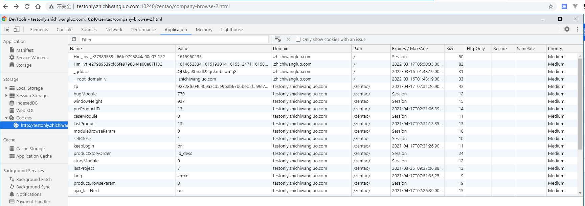

# test

## 防抖与节流

[防抖与节流](https://mp.weixin.qq.com/s/xGMUjQiZEI7PV8Wlvf_YNA)

> 涉及：

- 节流： n 秒内只执行一次，n秒内重复触发只执行一次

  ```js
  // 时间戳写法
  function throttled1(fn, delay = 500) {
    let oldTime = Date.now();
    return function (...args) {
      let newTime = Date.now();
      if (newTime - oldTime >= delay) {
        fn.apply(null, args)
        oldTime = Date.now();
      }
    }
  }
  ```

- 防抖：n 秒后执行一次，n秒内重复触发，则重新计时，n秒后执行一次


## 浮点精度丢失

[浮点精度丢失]()

> 涉及：二进制...

0.1 + 0.2 != 0.3 

因为0.1实际上不等于0.1

```js
// 使用toPrecision得到21位的精度
0.1.toPrecision(21) !== 0.1
```

```js
/**
 * 获取精度小数（一般精度达到16位即可）
 */
function strip(num, precision = 12) {
  return +parseFloat(num.toPrecision(precision));
}
/**
 * 精确加法
 */
function add(num1, num2) {
  const num1Digits = (num1.toString().split('.')[1] || '').length;
  const num2Digits = (num2.toString().split('.')[1] || '').length;
  const baseNum = Math.pow(10, Math.max(num1Digits, num2Digits));
  return (num1 * baseNum + num2 * baseNum) / baseNum;
}
```

## 函数缓存

[函数缓存](https://mp.weixin.qq.com/s/rbzx-KxC1PlhRV2_Wtbr4Q)

> 涉及：闭包、高阶函数、柯里化

实现原理：闭包、柯里化、高阶函数

```js
const memoize = function (func, content) {
  let cache = Object.create(null) // 在当前函数作用域定义了一个空对象，用于缓存运行结果
  content = content || this
  // 运用柯里化返回一个函数，返回的函数由于闭包特性，可以访问到cache
  return (...key) => {
    // 然后判断输入参数是不是在cache的中。如果已经存在，直接返回cache的内容，如果没有存在，使用函数func对输入参数求值，然后把结果存储在cache中
    if (!cache[key]) {
      cache[key] = func.apply(content, key)
    }
    return cache[key]
  }
}

const add = (a,b) => a+b;
const calc = memoize(add); // 函数缓存
calc(10,20);// 30
calc(10,20);// 30 缓存
```

## 函数式编程

[函数式编程](https://mp.weixin.qq.com/s/4UhogYD4HK7bBtmW12HmKg)

> 涉及：编程范式、高阶函数、柯里化、组合与管道函数

主要编程范式：命令式，声明式，函数式

相比命令式编程，函数式编程更加强调程序执行的结果而非执行的过程，倡导利用若干简单的执行单元让计算结果不断渐进，逐层推导复杂的运算，而非设计一个复杂的执行过程

例如：

```js
// 命令式编程
var array = [0, 1, 2, 3]
for(let i = 0; i < array.length; i++) {
    array[i] = Math.pow(array[i], 2)
}

// 函数式方式
[0, 1, 2, 3].map(num => Math.pow(num, 2))
```

## JavaScript本地缓存

[JavaScript本地缓存](https://mp.weixin.qq.com/s/XwzBwC7tpnZ590B3TXI8BQ)

> 涉及：本地存储

`JavaScript` 本地缓存方式

- cookie
- sessionStorage
- localStorage
- indexedDB

### cookie

存储大小：4kb左右

常用属性：

- Expires: 设置 `Cookie` 的过期时间，例如：```Expires=Wed, 21 Oct 2015 07:28:00 GMT```
- Max-Age: 设置在 `Cookie` 失效之前需要经过的秒数（优先级比`Expires`高），例如：```Max-Age=604800```
- Domain: 指定了 Cookie 可以送达的主机名
- Path: 指定了一个 URL路径，这个路径必须出现在要请求的资源的路径中才可以发送 Cookie 首部

例如：



例子：

```js
document.cookie = "username=Bill Gates; expires=Sun, 31 Dec 2017 12:00:00 UTC; path=/";
```

### localStorage

存储大小：5MB左右

```js
localStorage.setItem('username', {name: 'ashen'});
localStorage.key(0) // 'username' 获取第一个键名（非按顺序存储，而是key会按照a-z排序）
console.log(localStorage.getItem('username')); // '[object, Object]' 只能存入字符串，无法直接存对象
localStorage.removeItem('username')
localStorage.clear() // 一次性清除所有存储
```

由于 localStorage 的持久化储存，不主动清除不会过期，因此可拓展

```js
/**
 * 缓存值到localStorage，可带上过期时间（单位：秒）
 * 例如缓存test的值10秒：newStorage.setItem({ name: 'test', value: '测试10秒过期', expires: 10 })
 */
export const newStorage = {
  /**
   * 设置缓存
   * @param {StorageItem} params 缓存值
   */
  setItem(params: StorageItem) {
    let obj: StorageItem = {
      name: 'storage',
      value: '',
      expires: 0,
      startTime: new Date().getTime() // 记录何时将值存入缓存，毫秒级
    };
    let options: StorageItem = {};
    // 将obj和传进来的params合并
    Object.assign(options, obj, params);
    if (options.expires) {
      // 如果options.expires设置了的话
      // 以options.name为key，options为值放进去
      options.expires = options.expires * 1000;
      localStorage.setItem(options.name, JSON.stringify(options));
    } else {
      // 如果options.expires没有设置，就判断一下value的类型
      let type = Object.prototype.toString.call(options.value);
      // 如果value是对象或者数组对象的类型，就先用JSON.stringify转一下，再存进去
      if (type === '[object Object]') {
        options.value = JSON.stringify(options.value);
      }
      if (type === '[object Array]') {
        options.value = JSON.stringify(options.value);
      }
      localStorage.setItem(options.name, options.value);
    }
  },
  /**
   * 获取缓存的值
   * @param name 缓存的key
   * @returns values || null
   */
  getItem (name: string) {
    let item: any = localStorage.getItem(name);
    // 先将拿到的试着进行json转为对象的形式
    try {
      item = JSON.parse(item);
    } catch (error) {
      // 如果不行就不是json的字符串，就直接返回
      item = item;
    }
    console.info(item)
    // 如果有startTime的值，说明设置了失效时间
    if (item && item.startTime) {
      let date = new Date().getTime();
      // 何时将值取出减去刚存入的时间，与item.expires比较，如果大于就是过期了，如果小于或等于就还没过期
      if (date - item.startTime > item.expires) {
        // 缓存过期，清除缓存，返回false
        localStorage.removeItem(name);
        return false;
      } else {
        // 缓存未过期，返回值
        return item.value;
      }
    } else {
      // 如果没有设置失效时间，直接返回值
      return item;
    }
  },
  /**
   * 移出缓存
   * @param name 缓存的key
   */
  removeItem (name) {
    localStorage.removeItem(name);
  },
  /**
   * 移除全部缓存
   */
  clear () {
    localStorage.clear();
  }
};
```

### sessionStorage

`sessionStorage` 和 `localStorage` 使用方法基本一致，唯一不同的是生命周期，一旦页面（会话）关闭，`sessionStorage` 将会删除数据

### indexedDB

IndexedDB的存储空间是没有限制

所有操作都是异步的，相比 LocalStorage 同步操作性能更高，尤其是数据量较大时

原生支持储存JS的对象

是个正经的数据库，持久化，意味着数据库能干的事它都能干

[使用教程](https://segmentfault.com/a/1190000019006851)

```js
var data = [{
  id: 1,
  name: 'Tom',
  age: '18'  
}, {
  id: 2,  
  name: 'Tommy',
  age: '16'
}]  
// 打开数据库，两个参数（数据库名字，版本号），如果数据库不存在则创建一个新的库
var request = window.indexedDB.open('myDatabase', '1')
// 数据库操作过程中出错，则错误回调被触发
request.onerror = (event) => {
  console.log(event)
}
// 数据库操作一切正常，所有操作后触发
request.onsuccess = (event) => {
  var db = event.target.result
  // 数据读取
  var usersObjectStore = db.transaction('users').objectStore('users')
  var userRequest = usersObjectStore.get(1)
  userRequest.onsuccess = function (event) {
    console.log(event.target.result)
  }
}
// 创建一个新的数据库或者修改数据库版本号时触发
request.onupgradeneeded = (event) => {
  var db = event.target.result
  // 创建对象仓库用来存储数据，把id作为keyPath，keyPath必须保证不重复，相当于数据库的主键
  var objectStore = db.createObjectStore('users', { keyPath: 'id'})
  // 建立索引，name和age可能重复，因此unique设置为false
  objectStore.createIndex('name', 'name', {unique: false})
  objectStore.createIndex('age', 'age', {unique: false})
  // 确保在插入数据前对象仓库已经建立
  objectStore.transaction.oncomplete = () => {
    // 将数据保存到数据仓库
    var usersObjectStore = db.transaction('users', 'readwrite').objectStore('users')
    data.forEach(data => {
      usersObjectStore.add(data)
    })
  }
}
```

### 区别

> 数据与服务器之间的交互方式，cookie的数据会自动的传递到服务器，服务器端也可以写cookie到客户端；sessionStorage和localStorage不会自动把数据发给服务器，仅在本地保存

- 标记用户与跟踪用户行为的情况，推荐使用cookie
- 适合长期保存在本地的数据（令牌），推荐使用localStorage
- 敏感账号一次性登录，推荐使用sessionStorage
- 存储大量数据的情况、在线文档（富文本编辑器）保存编辑历史的情况，推荐使用indexedDB

## 内存泄露

[内存泄露](https://mp.weixin.qq.com/s/01_qwiL37Jz9nY57fh7fDA)

> 涉及：垃圾回收机制

- 标记清除（标记进入环境，离开环境）
  
  ```js
    var m = 0,n = 19 // 把 m,n,add() 标记为进入环境。
    add(m, n) // 把 a, b, c标记为进入环境。
    console.log(n) // a,b,c标记为离开环境，等待垃圾回收。
    function add(a, b) {
    a++
    var c = a + b
    return c
    }
  ```

- 引用计数

    ```js
    const arr = [1, 2, 3, 4];   // 尽管后面的代码没有用到arr，它还是会持续占用内存
    console.log('hello world');

    // 通过设置arr为null，就解除了对数组[1,2,3,4]的引用，引用次数变为 0，就被垃圾回收了
    arr = null
    ```

有了垃圾回收机制，不代表不用关注内存泄露。那些很占空间的值，一旦不再用到，需要检查是否还存在对它们的引用。如果是的话，就必须手动解除引用

常见内存泄露：

```js
function foo(arg) {
    // 意外的全局变量
    bar = "this is a hidden global variable"; 
}

function foo() {
    this.variable = "potential accidental global";
}
// foo 调用自己，this 指向了全局对象（window）
foo();
```