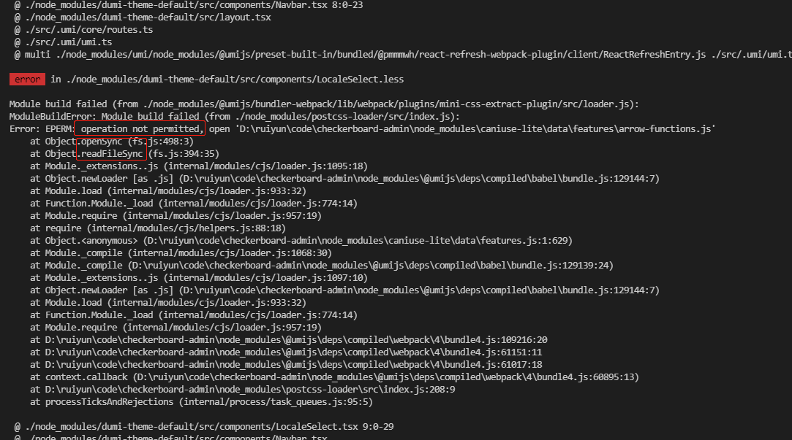
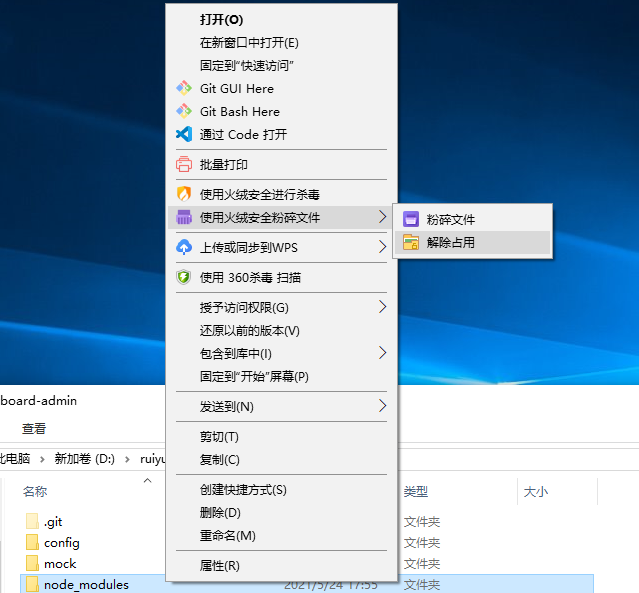
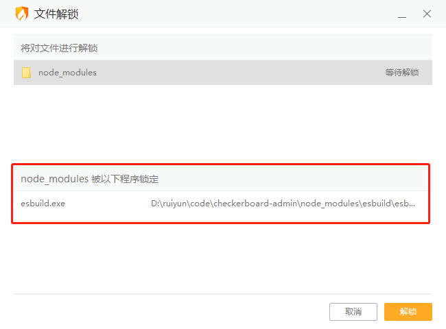

# React开发踩坑记录

问题：yarn start 运行项目提示 operation 权限问题

    

原因分析：node_modules文件夹的内容被占用了

解决方案：解除当前文件的占用状态即可，具体如下

1. ~~重启电脑~~

2. 使用*火绒*解除文件的占用

    需要先安装粉碎工具

    

    

    如图，当前文件夹被其他程序所占用，解锁即可

    